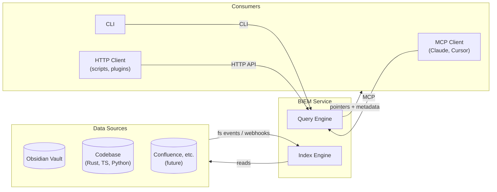
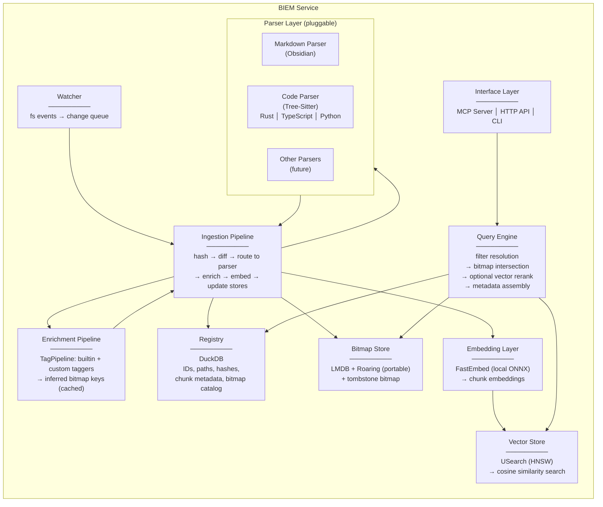
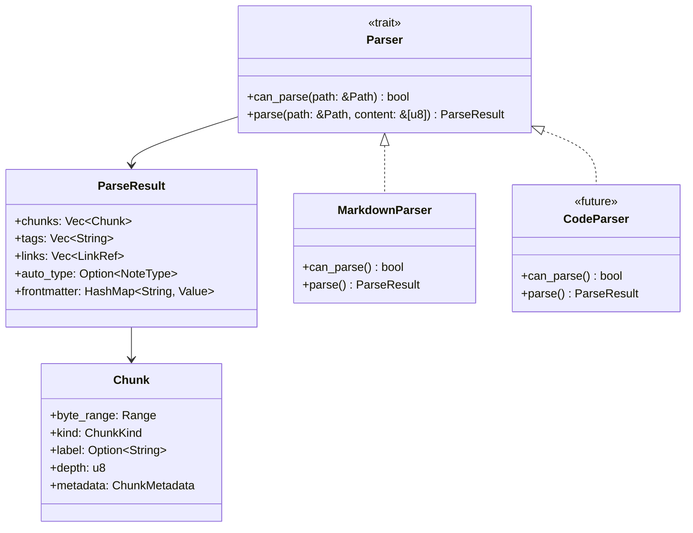
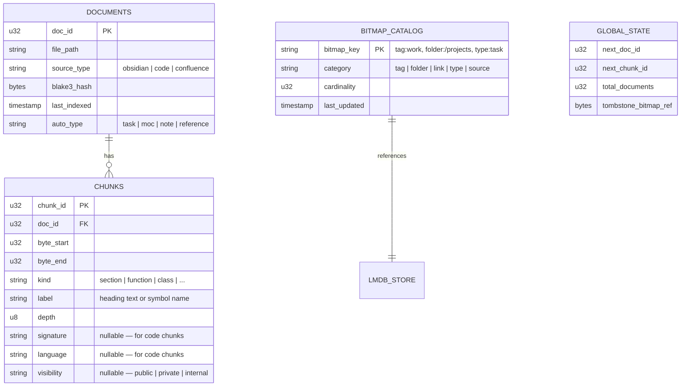
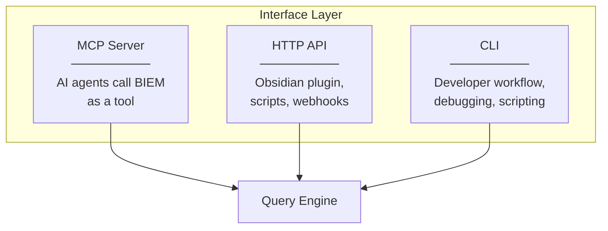
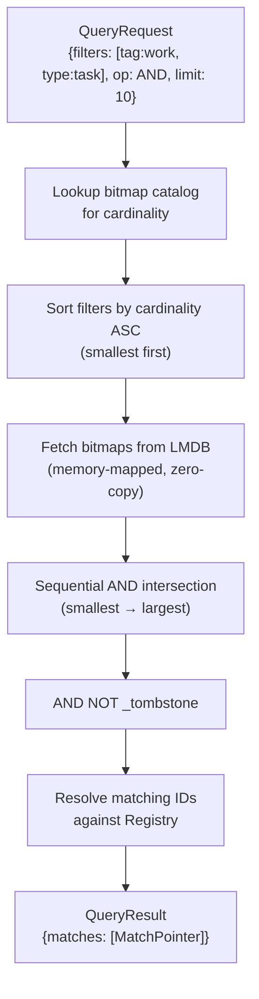
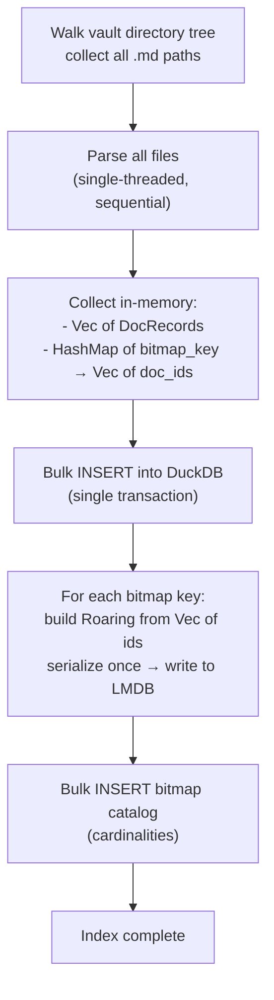
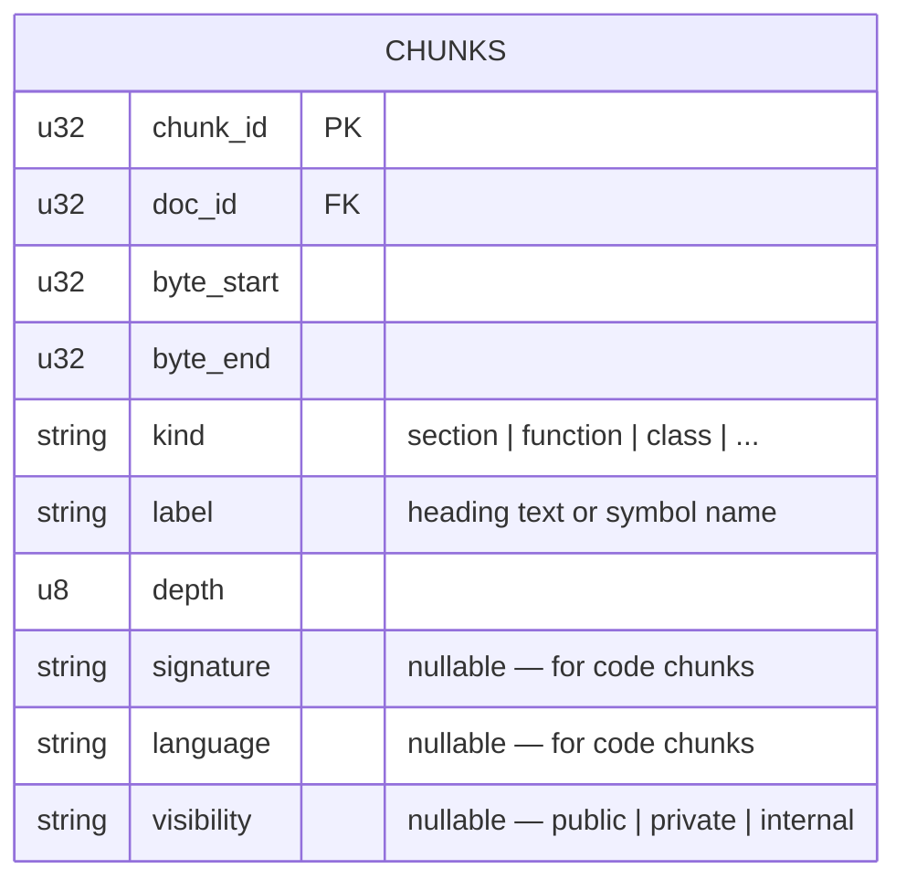
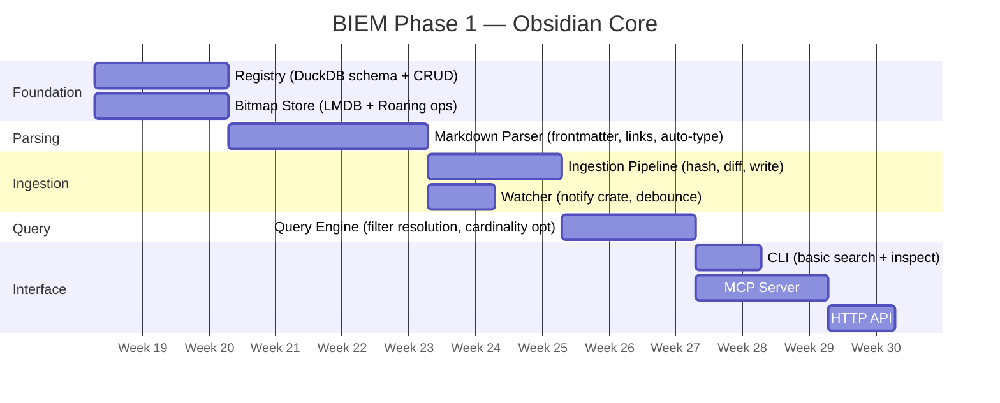

# BIEM System Architecture — Overview

> Status: **Phase 2 — Code intelligence implemented (Rust, TypeScript, Python)**
> Scope: Obsidian vault + codebase indexing, designed for extensibility to confluence/other sources
> See also: `002-roadmap.md` for phased build plan

## Decisions from Iteration 1

| # | Decision |
|---|----------|
| Q1 | **Parser is a separate module** — decoupled from ingestion so different parsers (markdown, code, etc.) can plug into the same ingestion pipeline |
| Q2 | **Chunking is flexible** — the registry stores chunk metadata with a configurable granularity strategy per source type |
| Q3 | **Tombstone bitmap for deletes** — lazy cleanup, most scalable. File moves update the registry path + folder bitmaps, same ID retained |
| Q4 | **BIEM returns metadata pointers, not content** — the LLM decides what to read. Multiple interface modes (MCP, HTTP API, CLI). See §6 for exploration |
| Q5 | **Semantic layer (Qdrant/vector/reranker) is a follow-on phase** — contracts designed to accommodate it |

---

## 1. High-Level System Boundary (Revised)

BIEM is a **local indexing and filtering service**. It does not retrieve content — it tells you *where* the relevant content is and *why* it matched, then the consumer decides what to read.

**Core goal: minimise context pollution.** LLMs degrade when given irrelevant context. BIEM's job is to ensure only the most structurally relevant pointers reach the model — not "here are 50 similar notes", but "here are the 3 notes that are tagged #work, typed as tasks, and linked to your current project". The bitmap pre-filter eliminates noise *before* any semantic or LLM processing, so the model's limited context window is spent on signal, not noise.



Key shift from v1: BIEM is a **pointer service**. It returns structured metadata (file path, chunk range, tags, type, match reason) — not the content itself.

---

## 2. Module Decomposition (Revised)

Eight modules, with clear separation between parsing, enrichment, and ingestion:



### Module contracts summary

| Module | Input | Output | Owns |
|--------|-------|--------|------|
| **Watcher** | fs events | `ChangeEvent { path, kind }` | Nothing persistent |
| **Parser (trait)** | Raw file bytes + path | `ParseResult { frontmatter, chunks, links, tags, auto_type }` | Nothing — pure function |
| **Enrichment** | `ParseResult` + content bytes | Inferred tags (e.g. `topic:auth`, `size:small`) | Tagger cache (filesystem) |
| **Embedding** | Chunk text | `EmbeddingVector` (f32 dense vectors) | Model cache (`~/.cache/fastembed/`) |
| **Ingestion** | `ChangeEvent` | Writes to Registry + Bitmap Store + Vector Store | Diffing logic, BLAKE3 hashing |
| **Registry** | CRUD operations | `DocRecord`, `ChunkRecord`, `BitmapCatalogEntry` | DuckDB |
| **Bitmap Store** | key → bitmap ops | Roaring Bitmaps (serialized portable) | LMDB |
| **Vector Store** | chunk_id → vector ops | Cosine similarity results | USearch (HNSW) |
| **Query Engine** | `QueryRequest` / `SemanticQueryRequest` | `QueryResult` / `SemanticQueryResult` | Query planning, bitmap→vector scoping |
| **Interface Layer** | Protocol-specific requests | Protocol-specific responses | MCP/HTTP/CLI translation |

---

## 3. The Parser Trait

The parser is a **pluggable contract**. Ingestion doesn't know what kind of file it's processing — it delegates to a parser that implements a common trait.



For the Obsidian phase, we build `MarkdownParser`. It extracts:
- YAML frontmatter (tags, aliases, custom fields)
- `[[wikilinks]]` and `[markdown](links)`
- Header hierarchy (for chunk boundaries)
- Structural patterns → auto-type (task list density, link density, etc.)

---

## 4. Registry Schema (DuckDB)

The registry supports both file-level and chunk-level records, plus the bitmap catalog.



### File move handling

A rename/move is:
1. `UPDATE documents SET file_path = new_path WHERE doc_id = X`
2. Remove `doc_id` from old `folder:{old_path}` bitmap
3. Insert `doc_id` into `folder:{new_path}` bitmap
4. All other bitmaps (tags, links, type) unchanged — same ID

This is cheap. The ID is stable. No downstream impact.

### File delete handling

1. Insert `doc_id` into the **tombstone bitmap**
2. Registry row stays (marked deleted or just masked out by tombstone)
3. Every query automatically applies `AND NOT tombstone` before returning results
4. Periodic compaction job: actually removes tombstoned IDs from all bitmaps and the registry

---

## 5. Bitmap Store — Key Schema

Every bitmap in LMDB is keyed by a namespaced string. The bitmap catalog in DuckDB tracks what exists and its cardinality.

```
LMDB Keys:
  tag:work           → Roaring Bitmap (portable serialized)
  tag:urgent         → Roaring Bitmap
  tag:work/project/a → Roaring Bitmap
  folder:/projects   → Roaring Bitmap
  folder:/daily      → Roaring Bitmap
  link:ProjectAlpha  → Roaring Bitmap (all docs that link TO ProjectAlpha)
  type:task          → Roaring Bitmap
  type:moc           → Roaring Bitmap
  _tombstone         → Roaring Bitmap (special: deleted IDs)
```

### Hierarchical tag flattening

For a note tagged `#work/project/alpha`, ingestion inserts the doc_id into **three** bitmaps:
- `tag:work`
- `tag:work/project`
- `tag:work/project/alpha`

A filter for `tag:work` catches everything underneath without any traversal.

---

## 6. Interface Layer — Three Modes

BIEM exposes the same query engine through three interfaces:



| Mode | Use case | Why |
|------|----------|-----|
| **MCP** | AI agent calls `biem_search` as a tool | Primary AI integration. Agent gets pointers, decides what to read. |
| **HTTP API** | Obsidian plugin, VS Code extension, scripts | Non-MCP integrations. Could power a sidebar showing "related notes by bitmap". |
| **CLI** | `biem search --tag work --type task` | Debugging, shell pipelines, demos. Essential for development. |

### Response payload (all modes return the same core data)

```
MatchPointer {
    doc_id: u32,
    file_path: String,
    source_type: "obsidian",
    chunks: [{ chunk_id, kind, byte_start, byte_end, label }],
    matched_filters: ["tag:work", "type:task"],
    auto_type: "task",
    score: Option<f32>,          // future: semantic score
    last_modified: Timestamp,
}
```

The consumer (LLM, CLI user, script) decides whether to read the file, read a chunk, or use it as context for a follow-up.

---

## 7. Query Engine — Filter Resolution



The cardinality sort is the key optimisation: if `type:task` has 12 entries and `tag:work` has 50,000, we start with the 12-entry bitmap. CPU work is proportional to the smallest set.

---

## 8. Decisions from Iteration 2

| # | Decision |
|---|----------|
| Q1 | **Yes — SourceFeed trait** with filesystem watcher as the first implementation |
| Q2 | **Single-threaded sequential for Phase 1** — concurrency is a roadmap item (see `002-roadmap.md`) |
| Q3 | **CLI design approved** — first pass as shown below |
| Q4 | **Configurable via `biem config`** — supports `~/.biem/` (global) and `.biem/` (local/co-located). See §8.1 |
| Q5 | **Needs further exploration** — see §8.2 |

### 8.1 Configuration & State Directory

BIEM uses a two-tier config model:

```
~/.biem/                          # Global config
  config.toml                     # Default settings, registered vaults
  vaults/
    <vault-hash>/                 # Per-vault state (default location)
      registry.duckdb
      bitmaps.lmdb/
      index.lock

<vault-path>/.biem/               # Local state (opt-in via biem config)
  registry.duckdb
  bitmaps.lmdb/
  index.lock
```

The `biem config` command controls this:
```
biem config                       # show current config
biem config --storage local       # store state inside the vault (.biem/)
biem config --storage global      # store state in ~/.biem/vaults/<hash>/
```

**Default is global** (`~/.biem/`) — keeps the vault clean, avoids polluting git/sync. Local is available for portability or when the vault and index should travel together.

The global config tracks registered vaults:
```toml
# ~/.biem/config.toml
[vaults.my-notes]
path = "/Users/me/Documents/Obsidian"
storage = "global"  # or "local"
source_type = "obsidian"

[vaults.work-vault]
path = "/Users/me/Work/Notes"
storage = "local"
source_type = "obsidian"
```

CLI flow:
```
biem init /path/to/vault          # registers vault, creates state dir
biem init /path/to/vault --local  # same but stores state inside vault
```

### 8.2 Initial Indexing vs Incremental — Exploration

There are two fundamentally different ingestion scenarios:

**Incremental** (steady state): A file changes → watcher fires → parse one file → update stores. Simple, well-understood.

**Initial** (`biem init` on a 10k+ note vault): Walk the entire directory tree, parse everything, populate the registry and bitmap store from scratch.

The challenge with initial indexing is **write amplification**:
- Each file produces 1 registry insert + N bitmap updates
- 10,000 files × ~5 tags average = 50,000 bitmap mutations
- Each LMDB write for a bitmap requires deserialize → mutate → serialize → write

**Proposed approach — Batch-then-flush:**



Key difference: instead of deserialize-mutate-serialize per file, we **accumulate all IDs per bitmap key in memory** and build each Roaring Bitmap once at the end. For 10k files this is trivially small in memory (~a few MB of integer vectors) but avoids tens of thousands of LMDB round-trips.

After initial indexing completes, the watcher starts and all subsequent changes go through the incremental path.

| Aspect | Initial (batch) | Incremental (per-file) |
|--------|-----------------|----------------------|
| Trigger | `biem init` | Watcher event |
| Parse | All files, sequential | Single file |
| Registry writes | Bulk INSERT (one txn) | Single INSERT/UPDATE |
| Bitmap writes | Build from scratch, serialize once | Deserialize → mutate → serialize |
| Expected perf (10k files) | Seconds | Milliseconds per file |

---

## 9. Exploration: 32-bit vs 64-bit ID Space

### The question

Should `DocId` and `ChunkId` be `u32` or `u64`? And should users be able to choose?

### Capacity analysis

| ID width | Max IDs | Enough for... |
|----------|---------|---------------|
| `u32` | ~4.29 billion | ~4.29B chunks across all sources |
| `u64` | ~18.4 quintillion | Effectively unlimited |

Let's estimate realistic upper bounds:

| Scenario | Documents | Avg chunks/doc | Total chunks |
|----------|-----------|----------------|-------------|
| Personal Obsidian vault | 10,000 | 5 | 50,000 |
| Large Obsidian vault | 100,000 | 5 | 500,000 |
| Single large codebase | 50,000 files | 20 (functions/classes) | 1,000,000 |
| 10 large repos | 500,000 files | 20 | 10,000,000 |
| Enterprise (100 repos, aggressive chunking) | 5,000,000 files | 30 | 150,000,000 |

Even the extreme enterprise case uses ~150M IDs — **3.5% of `u32` space**. You'd need ~860 enterprise-scale organisations in a single index to exhaust `u32`.

### The Roaring Bitmap constraint

This is the critical factor. Standard Roaring Bitmaps operate on **32-bit integers only**.

| | 32-bit Roaring | 64-bit Roaring |
|---|---|---|
| Crate | `roaring` (mature, well-optimised) | `roaring` has `Treemap` (a `BTreeMap<u32, RoaringBitmap>`) |
| SIMD acceleration | Yes — full AVX2/NEON support | Partial — SIMD within each 32-bit partition, overhead between partitions |
| Portable format | Standard, cross-language | No standard portable format for 64-bit |
| Memory overhead | Minimal | Extra `BTreeMap` layer per bitmap |
| Set operations (AND/OR) | Single pass, cache-friendly | Must align and iterate partitions |

The 64-bit `Treemap` in the `roaring` crate works by splitting the 64-bit space into high-32 / low-32 partitions. If your IDs are all in the low range (which they will be — monotonically increasing from 0), every ID falls into partition 0, and you're effectively using 32-bit Roaring with extra wrapper overhead.

If IDs are **sparse across the 64-bit space** (e.g., hashed IDs), the `Treemap` adds real overhead on every set operation.

### What about separate ID spaces?

Currently the architecture uses a **single ID space** for all chunks across all sources. An alternative:

```
Option A (current): Single monotonic ID space
  doc_id: u32 = 0, 1, 2, 3, ...
  chunk_id: u32 = 0, 1, 2, 3, ...
  All bitmaps use the same ID space.

Option B: Partitioned ID space
  High bits = source/partition, low bits = local ID
  e.g., u32 with top 8 bits = source → 256 sources × 16M docs each
  Still u32, but structured.

Option C: Two-tier IDs
  doc_id: u32 (used in structural bitmaps — tags, folders, links)
  chunk_id: u32 (used in future semantic/vector index)
  Bitmaps only index doc_ids. Chunks are resolved via registry lookup.
```

**Option C is what we already have** — the bitmap store indexes `DocId`, and chunks are a registry detail. The semantic layer (Phase 2) would use `ChunkId` for its vector index, but Roaring Bitmaps never need to hold chunk IDs.

This means the bitmap capacity question is really: **how many documents (files)?** Not chunks. And `u32` gives us 4.29 billion files — well beyond any realistic scenario.

### Could we make it configurable?

Technically yes, via a generic:

```rust
pub trait IdWidth: Copy + Ord + Hash + Into<u64> + TryFrom<u64> {
    type Bitmap: BitmapOps;
}

impl IdWidth for u32 {
    type Bitmap = RoaringBitmap;     // standard, fast
}

impl IdWidth for u64 {
    type Bitmap = RoaringTreemap;    // wrapper, slower
}
```

But this adds generic parameters to **every module** (`Registry<I: IdWidth>`, `BitmapStore<I: IdWidth>`, `QueryEngine<I: IdWidth>`). For a benefit that's never triggered in practice, it's significant complexity.

### 64-bit SIMD support — does it exist?

The key operations for bitmap search are XOR and POPCNT on wide registers:

| ISA | Register width | Instructions | Status |
|-----|---------------|-------------|--------|
| x86 AVX2 | 256-bit | `vpxor`, `vpopcntq` (Ice Lake+) | Widely available. Operates on 4×64-bit or 8×32-bit lanes — **the integer width inside the lane doesn't matter for raw bitwise ops** |
| x86 AVX-512 | 512-bit | `vpxorq`, `vpopcntq` | Available on server CPUs, some consumer (Zen 4+) |
| ARM NEON | 128-bit | `veor`, `vcnt` | All Apple Silicon, most ARM64 |
| ARM SVE2 | 128-2048-bit | Scalable vector ops | Server ARM (Graviton 3+) |

**Important insight**: SIMD doesn't care whether your integers are 32-bit or 64-bit. XOR on a 256-bit register is just XOR on 256 bits — the "integer width" is a software abstraction, not a hardware one.

The reason 64-bit Roaring is slower isn't SIMD — it's the **data structure overhead**. The `Treemap` must:
1. Align partitions between two bitmaps before intersecting
2. Handle missing partitions (one bitmap has partition 3, the other doesn't)
3. Iterate a `BTreeMap` which is pointer-heavy and cache-unfriendly

If all your IDs fall in the same partition (which they do with monotonic assignment), 64-bit Roaring is just 32-bit Roaring with an unnecessary wrapper.

### What if we want to bitmap chunks in future?

This is the real architectural question. Right now:
- **Bitmaps index `DocId`** (file-level) — "which files have tag X?"
- **Chunks are registry metadata** — resolved after bitmap intersection

If we wanted chunk-level bitmaps (e.g., "which chunks are exported functions?"), we have two paths:

**Path A: Chunks get their own `u32` ID in the same bitmap space**

```
Current:  doc_id 0, 1, 2, 3...         (files)
Future:   chunk_id 0, 1, 2, 3...       (chunks, separate bitmaps)

tag:work          → bitmap of doc_ids     (file-level)
symbol:exported   → bitmap of chunk_ids   (chunk-level, separate namespace)
```

This works if we keep the bitmap namespaces separate — file-level bitmaps hold `DocId`, code-level bitmaps hold `ChunkId`. The query engine knows which namespace it's operating in. **No `u64` needed** — each namespace gets its own `u32` space (4.29B files + 4.29B chunks).

The query becomes a two-stage resolve:
```
1. Intersect file-level bitmaps → matching DocIds
2. Intersect chunk-level bitmaps → matching ChunkIds
3. Join: chunk.doc_id IN matching_doc_ids AND chunk_id IN matching_chunk_ids
```

**Path B: Unified ID space (doc + chunk in one bitmap)**

You'd need to fit both files and chunks into the same `u32` space. With monotonic IDs this is fine capacity-wise, but it means a single bitmap like `tag:work` would contain a mix of doc_ids and chunk_ids — which is semantically messy.

**Recommendation: Path A** — separate namespaces, both `u32`. Clean, no capacity concern, no `u64` needed.

### The chunk schema is too document-centric

You're right. The current `Chunk` model assumes "a byte range inside a text file with a heading":

```rust
// Current — Obsidian-biased
pub struct Chunk {
    pub byte_range: Range<usize>,
    pub heading: Option<String>,
    pub depth: u8,
}
```

This doesn't capture code concepts. A code chunk needs:
- Function/class/module name
- Symbol kind (function, class, method, constant, import block)
- Visibility (public/private/exported)
- Language
- Signature (for functions — params + return type, without body)

We need a more general chunk model. Here's a proposed redesign:

```rust
/// A chunk boundary identified by the parser.
/// Flexible enough for both documents and code.
#[derive(Debug, Clone)]
pub struct Chunk {
    /// Byte range within the source file
    pub byte_range: Range<usize>,

    /// What kind of chunk this is
    pub kind: ChunkKind,

    /// Human-readable label (heading text, function name, class name)
    pub label: Option<String>,

    /// Nesting depth (heading depth for markdown, scope depth for code)
    pub depth: u8,

    /// Structured metadata specific to the chunk kind
    pub metadata: ChunkMetadata,
}

#[derive(Debug, Clone)]
pub enum ChunkKind {
    // Document chunks
    Section,        // Markdown section under a heading
    Frontmatter,    // YAML frontmatter block
    Body,           // Entire document body (no headings)

    // Code chunks (future)
    Function,
    Method,
    Class,
    Module,
    Import,
    Constant,
}

/// Kind-specific metadata. Avoids polluting every chunk
/// with fields only relevant to one type.
#[derive(Debug, Clone, Default)]
pub struct ChunkMetadata {
    /// For code: function signature, class declaration line
    pub signature: Option<String>,
    /// For code: language identifier
    pub language: Option<String>,
    /// For code: visibility/export status
    pub visibility: Option<Visibility>,
}

#[derive(Debug, Clone)]
pub enum Visibility {
    Public,
    Private,
    Internal, // e.g., pub(crate) in Rust
}
```

This means the `MarkdownParser` produces `ChunkKind::Section` chunks with no code metadata, and a future `CodeParser` produces `ChunkKind::Function` chunks with signature/visibility filled in. The ingestion pipeline and registry handle both uniformly.

The registry schema would also need updating:



The nullable code fields add no overhead for Obsidian chunks (DuckDB handles NULLs efficiently in columnar storage). But when code indexing arrives, the schema is ready without migration.

### Impact on bitmap-level chunk indexing (future)

If we adopt Path A (separate chunk bitmap namespace), adding chunk-level bitmaps later would require:

| Change | Scope |
|--------|-------|
| New bitmap namespace prefix (e.g., `chunk:symbol:exported`) | Bitmap Store — key convention only |
| ChunkId tracked in bitmaps | Ingestion — code parser inserts chunk_ids into chunk-level bitmaps |
| Query engine supports two-stage resolve | Query Engine — new query mode |
| Registry stores chunk-level bitmap catalog entries | Registry — new category in bitmap catalog |

This is **additive** — no existing file-level bitmaps or queries change. The query engine gains a new code path for chunk-level filtering, but the structural bitmap (tag/folder/link) path stays identical.

**Not a big rearchitecture.** The main prerequisite is getting the `Chunk` model right now (which this redesign does) so we don't need to migrate data later.

### Recommendation

**Use `u32` for both `DocId` and `ChunkId`. Don't make it configurable.**

Reasoning:
1. Capacity is not a concern — 4.29B documents is orders of magnitude beyond any personal or even enterprise use case
2. Roaring Bitmaps are natively 32-bit — no wrapper overhead, full SIMD, standard portable format
3. Bitmaps only index `DocId` (files), not `ChunkId` (sections/functions) — so the relevant space is even smaller
4. If somehow `u32` is exhausted in the future, it's a breaking migration anyway — generic `IdWidth` wouldn't save you from re-indexing
5. Simpler code, simpler contracts, fewer generics to thread through

If we ever hit a scale where `u32` doc IDs aren't enough, the architecture has bigger problems (DuckDB, LMDB, single-machine limits) and would need a fundamentally different design.

### What about ID recycling?

With tombstone-based deletes, IDs are never reused — they accumulate. Over a very long period with high churn:

| Scenario | New files/day | Days to exhaust u32 |
|----------|--------------|-------------------|
| Active vault | 10 | 1.17 million days (~3,200 years) |
| Heavy code churn | 1,000 | 11,700 days (~32 years) |
| CI/CD extreme | 100,000 | 117 days |

The CI/CD extreme is unrealistic for a local tool. But the compaction job (which reclaims tombstoned IDs) would reset the counter anyway — after compaction, IDs can be reassigned.

---

## 10. Phase 1 Module Build Sequence (Proposed)



Foundation (Registry + Bitmap Store) comes first because everything depends on them. Parser next because ingestion depends on it. Query engine once there's data to query. Interfaces last as thin layers over the query engine.
