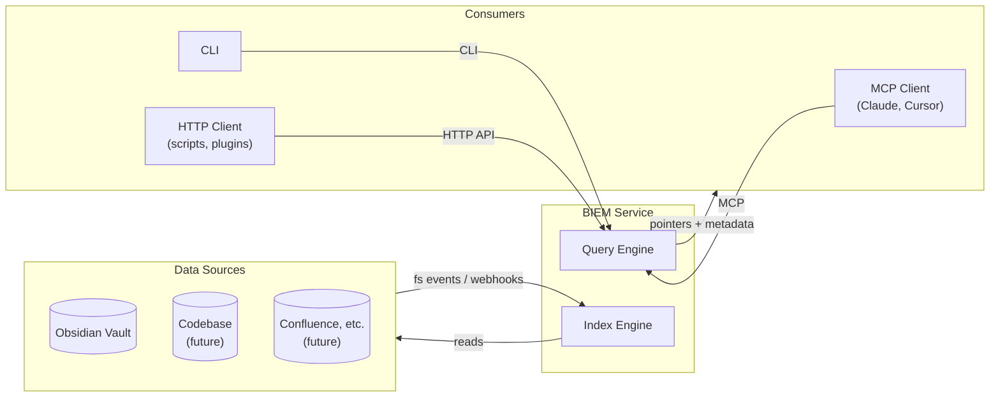
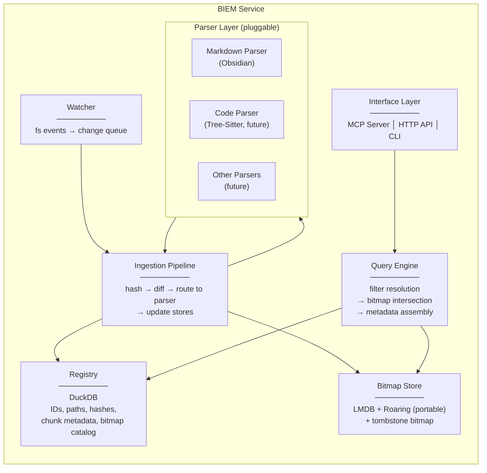
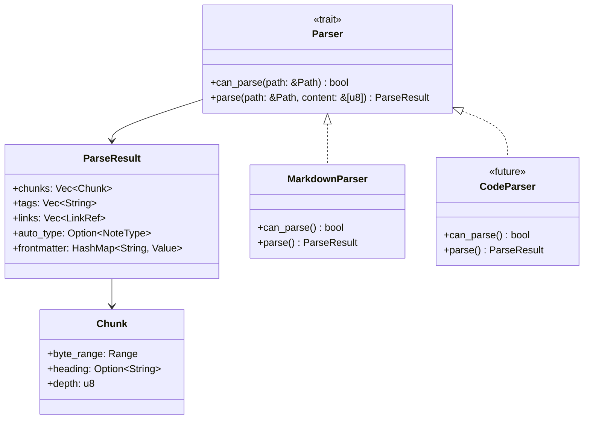
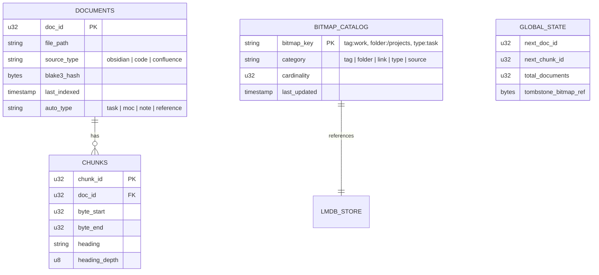
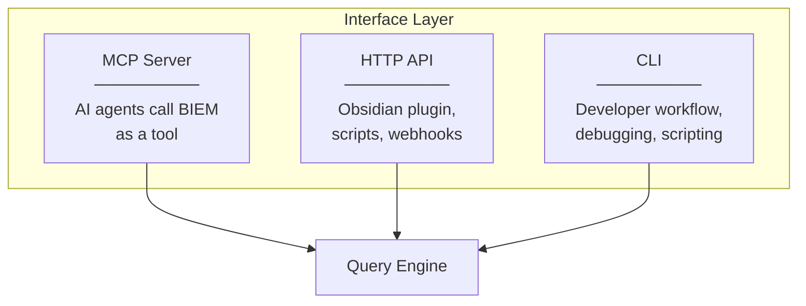
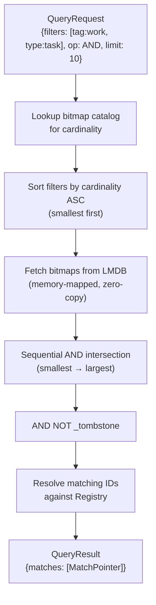
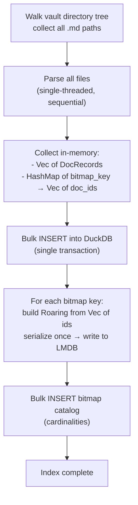
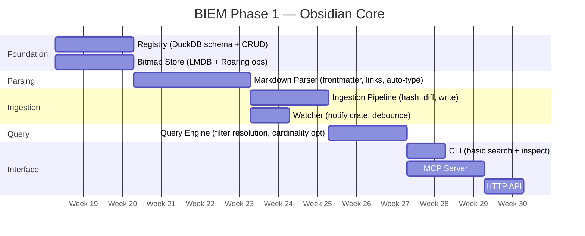

# BIEM System Architecture — Overview

> Status: **DRAFT — Iteration 2 (decisions resolved)**
> Scope: Obsidian vault use case first, designed for extensibility to code/confluence/other sources
> See also: `002-roadmap.md` for phased build plan

## Decisions from Iteration 1

| # | Decision |
|---|----------|
| Q1 | **Parser is a separate module** — decoupled from ingestion so different parsers (markdown, code, etc.) can plug into the same ingestion pipeline |
| Q2 | **Chunking is flexible** — the registry stores chunk metadata with a configurable granularity strategy per source type |
| Q3 | **Tombstone bitmap for deletes** — lazy cleanup, most scalable. File moves update the registry path + folder bitmaps, same ID retained |
| Q4 | **BIEM returns metadata pointers, not content** — the LLM decides what to read. Multiple interface modes (MCP, HTTP API, CLI). See §6 for exploration |
| Q5 | **Semantic layer (Qdrant/vector/reranker) is a follow-on phase** — contracts designed to accommodate it |

---

## 1. High-Level System Boundary (Revised)

BIEM is a **local indexing and filtering service**. It does not retrieve content — it tells you *where* the relevant content is and *why* it matched, then the consumer decides what to read.



Key shift from v1: BIEM is a **pointer service**. It returns structured metadata (file path, chunk range, tags, type, match reason) — not the content itself.

---

## 2. Module Decomposition (Revised)

Seven modules, with clear separation between parsing and ingestion:



### Module contracts summary

| Module | Input | Output | Owns |
|--------|-------|--------|------|
| **Watcher** | fs events | `ChangeEvent { path, kind }` | Nothing persistent |
| **Parser (trait)** | Raw file bytes + path | `ParseResult { frontmatter, chunks, links, tags, auto_type }` | Nothing — pure function |
| **Ingestion** | `ChangeEvent` | Writes to Registry + Bitmap Store | Diffing logic, BLAKE3 hashing |
| **Registry** | CRUD operations | `DocRecord`, `ChunkRecord`, `BitmapCatalogEntry` | DuckDB |
| **Bitmap Store** | key → bitmap ops | Roaring Bitmaps (serialized portable) | LMDB |
| **Query Engine** | `QueryRequest { filters, limit }` | `QueryResult { matches: [MatchPointer] }` | Query planning |
| **Interface Layer** | Protocol-specific requests | Protocol-specific responses | MCP/HTTP/CLI translation |

---

## 3. The Parser Trait

The parser is a **pluggable contract**. Ingestion doesn't know what kind of file it's processing — it delegates to a parser that implements a common trait.



For the Obsidian phase, we build `MarkdownParser`. It extracts:
- YAML frontmatter (tags, aliases, custom fields)
- `[[wikilinks]]` and `[markdown](links)`
- Header hierarchy (for chunk boundaries)
- Structural patterns → auto-type (task list density, link density, etc.)

---

## 4. Registry Schema (DuckDB)

The registry supports both file-level and chunk-level records, plus the bitmap catalog.



### File move handling

A rename/move is:
1. `UPDATE documents SET file_path = new_path WHERE doc_id = X`
2. Remove `doc_id` from old `folder:{old_path}` bitmap
3. Insert `doc_id` into `folder:{new_path}` bitmap
4. All other bitmaps (tags, links, type) unchanged — same ID

This is cheap. The ID is stable. No downstream impact.

### File delete handling

1. Insert `doc_id` into the **tombstone bitmap**
2. Registry row stays (marked deleted or just masked out by tombstone)
3. Every query automatically applies `AND NOT tombstone` before returning results
4. Periodic compaction job: actually removes tombstoned IDs from all bitmaps and the registry

---

## 5. Bitmap Store — Key Schema

Every bitmap in LMDB is keyed by a namespaced string. The bitmap catalog in DuckDB tracks what exists and its cardinality.

```
LMDB Keys:
  tag:work           → Roaring Bitmap (portable serialized)
  tag:urgent         → Roaring Bitmap
  tag:work/project/a → Roaring Bitmap
  folder:/projects   → Roaring Bitmap
  folder:/daily      → Roaring Bitmap
  link:ProjectAlpha  → Roaring Bitmap (all docs that link TO ProjectAlpha)
  type:task          → Roaring Bitmap
  type:moc           → Roaring Bitmap
  _tombstone         → Roaring Bitmap (special: deleted IDs)
```

### Hierarchical tag flattening

For a note tagged `#work/project/alpha`, ingestion inserts the doc_id into **three** bitmaps:
- `tag:work`
- `tag:work/project`
- `tag:work/project/alpha`

A filter for `tag:work` catches everything underneath without any traversal.

---

## 6. Interface Layer — Three Modes

BIEM exposes the same query engine through three interfaces:



| Mode | Use case | Why |
|------|----------|-----|
| **MCP** | AI agent calls `biem_search` as a tool | Primary AI integration. Agent gets pointers, decides what to read. |
| **HTTP API** | Obsidian plugin, VS Code extension, scripts | Non-MCP integrations. Could power a sidebar showing "related notes by bitmap". |
| **CLI** | `biem search --tag work --type task` | Debugging, shell pipelines, demos. Essential for development. |

### Response payload (all modes return the same core data)

```
MatchPointer {
    doc_id: u32,
    file_path: String,
    source_type: "obsidian",
    chunk: Option<{ byte_start, byte_end, heading }>,
    matched_filters: ["tag:work", "type:task"],
    auto_type: "task",
    score: Option<f32>,          // future: semantic score
    last_modified: Timestamp,
}
```

The consumer (LLM, CLI user, script) decides whether to read the file, read a chunk, or use it as context for a follow-up.

---

## 7. Query Engine — Filter Resolution



The cardinality sort is the key optimisation: if `type:task` has 12 entries and `tag:work` has 50,000, we start with the 12-entry bitmap. CPU work is proportional to the smallest set.

---

## 8. Decisions from Iteration 2

| # | Decision |
|---|----------|
| Q1 | **Yes — SourceFeed trait** with filesystem watcher as the first implementation |
| Q2 | **Single-threaded sequential for Phase 1** — concurrency is a roadmap item (see `002-roadmap.md`) |
| Q3 | **CLI design approved** — first pass as shown below |
| Q4 | **Configurable via `biem config`** — supports `~/.biem/` (global) and `.biem/` (local/co-located). See §8.1 |
| Q5 | **Needs further exploration** — see §8.2 |

### 8.1 Configuration & State Directory

BIEM uses a two-tier config model:

```
~/.biem/                          # Global config
  config.toml                     # Default settings, registered vaults
  vaults/
    <vault-hash>/                 # Per-vault state (default location)
      registry.duckdb
      bitmaps.lmdb/
      index.lock

<vault-path>/.biem/               # Local state (opt-in via biem config)
  registry.duckdb
  bitmaps.lmdb/
  index.lock
```

The `biem config` command controls this:
```
biem config                       # show current config
biem config --storage local       # store state inside the vault (.biem/)
biem config --storage global      # store state in ~/.biem/vaults/<hash>/
```

**Default is global** (`~/.biem/`) — keeps the vault clean, avoids polluting git/sync. Local is available for portability or when the vault and index should travel together.

The global config tracks registered vaults:
```toml
# ~/.biem/config.toml
[vaults.my-notes]
path = "/Users/me/Documents/Obsidian"
storage = "global"  # or "local"
source_type = "obsidian"

[vaults.work-vault]
path = "/Users/me/Work/Notes"
storage = "local"
source_type = "obsidian"
```

CLI flow:
```
biem init /path/to/vault          # registers vault, creates state dir
biem init /path/to/vault --local  # same but stores state inside vault
```

### 8.2 Initial Indexing vs Incremental — Exploration

There are two fundamentally different ingestion scenarios:

**Incremental** (steady state): A file changes → watcher fires → parse one file → update stores. Simple, well-understood.

**Initial** (`biem init` on a 10k+ note vault): Walk the entire directory tree, parse everything, populate the registry and bitmap store from scratch.

The challenge with initial indexing is **write amplification**:
- Each file produces 1 registry insert + N bitmap updates
- 10,000 files × ~5 tags average = 50,000 bitmap mutations
- Each LMDB write for a bitmap requires deserialize → mutate → serialize → write

**Proposed approach — Batch-then-flush:**



Key difference: instead of deserialize-mutate-serialize per file, we **accumulate all IDs per bitmap key in memory** and build each Roaring Bitmap once at the end. For 10k files this is trivially small in memory (~a few MB of integer vectors) but avoids tens of thousands of LMDB round-trips.

After initial indexing completes, the watcher starts and all subsequent changes go through the incremental path.

| Aspect | Initial (batch) | Incremental (per-file) |
|--------|-----------------|----------------------|
| Trigger | `biem init` | Watcher event |
| Parse | All files, sequential | Single file |
| Registry writes | Bulk INSERT (one txn) | Single INSERT/UPDATE |
| Bitmap writes | Build from scratch, serialize once | Deserialize → mutate → serialize |
| Expected perf (10k files) | Seconds | Milliseconds per file |

---

## 9. Phase 1 Module Build Sequence (Proposed)



Foundation (Registry + Bitmap Store) comes first because everything depends on them. Parser next because ingestion depends on it. Query engine once there's data to query. Interfaces last as thin layers over the query engine.
