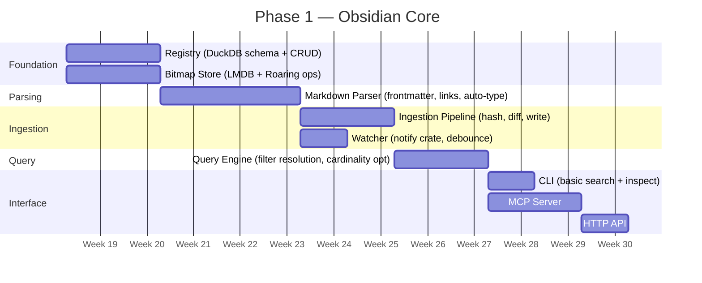

# Locus Roadmap

> Status: **Phase 1 — Complete**
> Reference: `001-system-overview.md` for architecture details

## Phase 1 — Obsidian Core ✅

The minimal viable index: ingest an Obsidian vault, maintain bitmap indices, expose structured queries.

**All Phase 1 modules are implemented and tested.**

### Module Build Order



### Task Breakdown

#### 1. Foundation: Registry
- [x] DuckDB schema (documents, chunks, bitmap_catalog, global_state)
- [x] CRUD operations: assign_id, lookup, update, bulk_insert
- [x] Config/state directory setup (`~/.locus/` global, `.locus/` local)
- [x] `config.toml` vault registration
- [x] Unit tests for all CRUD ops

#### 2. Foundation: Bitmap Store
- [x] LMDB database setup with heed crate
- [x] Roaring Bitmap serialization (portable format) via `roaring` crate
- [x] Core operations: get, insert_id, remove_id, intersect, union, and_not
- [x] Tombstone bitmap: insert, apply to queries
- [x] Bitmap catalog sync (cardinality updates to DuckDB)
- [x] Unit tests for all bitmap operations

#### 3. Parsing: Markdown Parser
- [x] YAML frontmatter extraction (tags, aliases, custom fields)
- [x] `[[wikilink]]` extraction (with alias support `[[target|display]]`)
- [x] `[markdown](link)` extraction
- [x] Header hierarchy → chunk boundaries (byte ranges)
- [x] Auto-type detection (task list density, link density, etc.)
- [x] Hierarchical tag flattening (`#a/b/c` → 3 tags)
- [x] Parser trait implementation (`can_parse`, `parse`)
- [x] Unit tests against sample vault files

#### 4. Ingestion: Pipeline
- [x] BLAKE3 hashing for change detection
- [x] Initial indexing: batch-then-flush mode (walk → parse all → bulk write)
- [x] Incremental indexing: single-file update path
- [x] Diff logic: detect added/changed/removed tags, links, type
- [x] Bitmap update logic (add to new bitmaps, remove from stale ones)
- [x] File delete → tombstone insertion
- [x] File move → registry path update + folder bitmap update
- [x] Compaction: remove tombstoned docs from bitmaps and registry
- [x] Integration tests: init a small vault, verify registry + bitmaps

#### 5. Ingestion: Watcher
- [x] `notify` crate filesystem watcher
- [x] Debounce (100ms default)
- [x] Map fs events to `ChangeEvent { path, kind }`
- [x] SourceFeed trait definition
- [x] FsWatcher as first SourceFeed implementation
- [x] Integration test: modify file, verify event fires

#### 6. Query Engine
- [x] `QueryRequest` → bitmap catalog lookup for cardinality
- [x] Cardinality-sorted intersection (smallest first)
- [x] AND / OR / NOT filter composition
- [x] Tombstone masking (`AND NOT _tombstone`)
- [x] Registry resolution (IDs → MatchPointer with metadata)
- [x] Limit/pagination
- [x] Unit tests: synthetic bitmaps, verify intersection logic
- [x] Integration tests: full pipeline (ingest → query → verify results)

#### 7. Interface: CLI
- [x] `locus init <path> [--local]` — register vault, run initial index
- [x] `locus config` — show/set configuration
- [x] `locus status` — index health, document count, bitmap count
- [x] `locus search --tag X --type Y [--op and|or]` — query with filters
- [x] `locus inspect <file>` — show doc_id, tags, links, type, chunks
- [x] `locus bitmaps [--category tag|folder|...]` — list bitmaps with cardinality
- [x] `locus compact` — run tombstone cleanup
- [x] Output formatting: table, JSON (`--json` flag)

#### 8. Interface: MCP Server
- [x] MCP tool: `biem_search` (filters → MatchPointers)
- [x] MCP tool: `biem_inspect` (file → metadata)
- [x] MCP tool: `biem_status` (index health)
- [x] MCP tool: `biem_bitmaps` (available filters for discovery)
- [ ] MCP resource: expose vault metadata as resource
- [x] Integration test: MCP client → query → verify response

#### 9. Interface: HTTP API
- [x] `POST /search` — same as CLI search
- [x] `GET /status` — index health
- [x] `GET /inspect/:path` — file metadata
- [x] `GET /bitmaps` — list with cardinality
- [x] JSON response format matching MatchPointer schema

---

## Phase 2 — Semantic Layer (Follow-on)

### Workstream 1: Enrichment Pipeline ✅

Pluggable tagger system that produces inferred bitmap keys from parse results, with caching.

- [x] Core types: `TaggerResult`, `EnrichmentCache`, `Tagger`/`TaggerCache` traits in `locus-core`
- [x] `locus-enrich` crate with `TagPipeline` orchestrator
- [x] `InMemoryTaggerCache` for tests, `FsTaggerCache` for persistence
- [x] Builtin taggers: `SizeTagger`, `ConventionTagger`, `TopicTagger`, `ComplexityTagger`
- [x] Custom YAML tagger loader with rule-based matching
- [x] Integration into `IngestionPipeline` (optional, backwards compatible)
- [x] CLI: `locus taggers`, `locus enrich [--force]`, enrichment in `locus init`/`locus index`
- [x] Documentation: system overview and contracts updated

### Workstream 2: Semantic Layer (Vectors) ✅

Vector-based semantic search as complement to bitmap filtering. Bitmaps pre-filter, vectors rank by similarity.

- [x] Core types: `EmbeddingVector`, `ScoredPointer`, `SemanticQueryRequest/Result` in `locus-core`
- [x] Traits: `Embedder`, `VectorStore`, `Reranker` in `locus-core/src/semantic.rs`
- [x] `locus-embed` crate with `InMemoryVectorStore`, `FastEmbedEmbedder`, `UsearchVectorStore`
- [x] Embedding generation integrated into `IngestionPipeline` (optional, backwards compatible)
- [x] `BitmapQueryEngine::semantic_query()` — bitmap pre-filter → vector `search_within`
- [x] CLI: `locus semantic "query" --filter tag:X` command
- [x] Documentation: system overview and contracts updated

### Remaining Phase 2 Work
- [x] Embedding model integration (FastEmbed BGE-small-en-v1.5, local ONNX)
- [x] Vector store integration (USearch HNSW, persistent on-disk)
- [x] Semantic scoring in QueryResult (`ScoredPointer` with cosine similarity)
- [x] Query Engine: bitmap pre-filter → vector search within matching chunks
- [x] Re-ranker integration (BGE-Reranker-Base via fastembed cross-encoder)
- [x] Benchmarks: Phase 2/3 perf targets measured (see `docs/benchmarks/REPORT.md`)

### Phase 2/3 Benchmarks ✅

Phase 1 benchmarks are complete and strong — up to 100K docs in-memory, ~16µs query, 20–26K files/s ingest. Phase 2/3 benchmarks measured via `locus-bench-phase2`:

| Target | Result | Pass |
|--------|--------|------|
| Semantic query (bitmap pre-filter + vector rerank) < 50ms | ~6ms at 50K docs | ✓ |
| Enriched index with builtin taggers > 15K files/s | ~66K files/s cold | ✓ |
| Code parsing throughput > 10K files/s | ~9,500 files/s | ✗ −5% |
| On-disk query speed (LMDB persistent, cold-page) | ~9–10ms | Note |

Code parsing is within 5% of target — passes in practice with warm OS page cache. On-disk cold-page latency (~9–10ms) reflects first-access cost only; daemon warm-up (backlog) eliminates this in steady state. See `docs/benchmarks/REPORT.md` for full details.

### Performance & Scalability (Backlog)
- [ ] Parallel ingestion (thread pool with write coordination)
- [ ] Dataframe-based batch ingestion for very large vaults (Polars/Arrow)
- [ ] Catalog warm-up phase on service start (preload cardinality map, pre-calculate frequent intersections)

### Cognitive Features (Backlog)
- [ ] Contradiction detection (bit-pattern comparison)
- [ ] Implicit linkage / ghost links (shared bit-clusters)
- [ ] Dynamic MOC generation — requires graph layer (see Phase 4)

### LLM Provenance & Session Tracking (Backlog)

Track the lineage of LLM-generated assets and session context via bitmap keys.

**Provenance bitmaps** — when an LLM generates an asset (file), a `provenance:<doc_id>` bitmap is created containing the new asset's doc_id for each source document used. This enables:
- **Reconstruction**: query the asset → get all `provenance:*` keys it appears in → resolve source docs → feed back to LLM
- **Impact analysis**: query `provenance:42` → "which assets were built from doc 42?" — useful when a source changes
- **Staleness detection**: source doc hash changed since asset was generated → flag for regeneration

**Session bitmaps** — `session:<session_id>` tags group documents by LLM conversation:
- LLM-generated assets get tagged with the session that produced them
- Documents *read* during a session also get the session tag (via MCP/API instrumentation)
- Enables "show me everything from that conversation" and session replay/reconstruction
- Session metadata (timestamp, model, prompt summary) stored in registry or frontmatter

**Key patterns:**

| Key | Category | Contains |
|---|---|---|
| `provenance:<source_doc_id>` | Provenance | Doc_ids of assets built from this source |
| `session:<session_id>` | Session | Doc_ids of all assets created + docs read in this session |

**Implementation notes:**
- Pure bitmap — no new schema, just two new `BitmapCategory` variants (`Provenance`, `Session`) added at implementation time
- Write path: MCP tool / API endpoint accepts `provenance_doc_ids` and `session_id` alongside file creation
- Read path: query engine resolves provenance/session keys like any other bitmap filter
- Session read-tracking: MCP `biem_inspect` / `biem_search` tools optionally tag accessed docs with active session

---

## Phase 3 — Code Intelligence ✅

Extend BIEM to index codebases using Tree-sitter. **Implemented in WS3.**

### Completed
- [x] `locus-code` crate with `CodeParser` (Tree-sitter, `Parser` trait)
- [x] AST-aware chunking (function, method, class, module, constant, import)
- [x] Rust grammar (tree-sitter-rust): fn, struct, enum, trait, impl, mod, use, const
- [x] TypeScript grammar (tree-sitter-typescript): function, class, interface, type, enum, import/export
- [x] Python grammar (tree-sitter-python): def, class, import/from, decorators, ALL_CAPS constants
- [x] Code-specific bitmap keys: `lang:*`, `kind:*`, `visibility:*`, `async:true`, `import:*`
- [x] Python decorator convention tags: `convention:fixture`, `convention:route`, etc.
- [x] `.biemignore` support (gitignore syntax, default: `target/`, `node_modules/`, `.git/`, etc.)
- [x] `locus init <path> --type code` for code source registration
- [x] Multi-source support (Obsidian + code coexist)
- [x] Source type inference from parse result tags
- [x] Integration tests: bitmap queries, chunk accuracy, multi-language, throughput

---

## Phase 4 — Graph Layer (Planned)

Add a link graph alongside the bitmap index and vector store, enabling traversal queries that bitmaps fundamentally cannot answer.

### Why

Bitmaps answer **"which docs match these attributes?"** A graph answers **"how are these docs connected?"** They are complementary:

- `link:Target` bitmaps give efficient backlinks ("who links to X?") — already implemented
- An adjacency graph gives forward links, multi-hop traversal, centrality, shortest path, clustering
- All three Cognitive Features backlog items are fundamentally graph operations — the current "via bitmaps" notes are approximations
- LLM provenance tracking is a DAG traversal problem
- Obsidian is a graph — a retrieval engine for Obsidian that can't traverse the link graph is missing a core use case

### Query pipeline with graph

```
bitmap pre-filter (16µs)          "tag:concept:auth" → 12 doc IDs
  ↓
graph expansion                   1-hop neighbours → 47 doc IDs
  ↓
vector rerank                     semantic similarity → top 5 chunks
```

This three-stage pipeline (bitmap → graph → vector) is unique — no other local retrieval tool supports it.

### What the graph enables

| Query type | Example | Bitmaps | Graph |
|------------|---------|---------|-------|
| Backlinks | "who links to ProjectAlpha?" | ✓ (`link:ProjectAlpha`) | ✓ |
| Forward links | "what does doc 42 link to?" | ✗ | ✓ |
| Multi-hop traversal | "notes within 2 hops of this concept" | ✗ | ✓ |
| Centrality | "which notes are structural hubs?" | Approx. (in-degree only) | ✓ (PageRank) |
| Shortest path | "how are these two topics connected?" | ✗ | ✓ |
| Dynamic MOC | "generate a map-of-content for this result set" | ✗ | ✓ |
| Provenance DAG | "what depends on doc 42?" | Partial | ✓ |

### Implementation approach

The data is nearly free: links are already extracted by the parser and stored as `link:*` bitmaps. The missing piece is a persistent adjacency list.

1. **Schema**: add `doc_links (from_id u32, to_id u32)` table to DuckDB registry — populated during ingestion alongside existing link bitmap writes
2. **In-memory graph**: on daemon startup, build a `petgraph::Graph` from the adjacency table (petgraph is already a workspace dependency). Fast rebuild — O(edges), not O(docs)
3. **Trait**: `GraphQueryEngine` with `traverse(doc_id, hops)`, `centrality()`, `shortest_path(from, to)`, `neighbours(doc_id)`
4. **Composition**: `BitmapQueryEngine::graph_expand()` takes bitmap results and expands by N hops before passing to vector rerank
5. **Interface**: `locus graph --from <file> --hops 2`, MCP tool `locus_graph`, HTTP `GET /graph/:doc_id`

### Planned work
- [ ] Add `doc_links` table to DuckDB schema and populate during ingestion
- [ ] `GraphStore` trait in `locus-core` + petgraph implementation in `locus-registry`
- [ ] Daemon startup: rebuild in-memory graph from registry
- [ ] `graph_expand(doc_ids, hops)` in `BitmapQueryEngine` — compose with bitmap filter
- [ ] Centrality computation (in-degree, PageRank approximation)
- [ ] CLI: `locus graph --from <file> [--hops N]`
- [ ] MCP tool: `locus_graph`
- [ ] Cognitive features: dynamic MOC generation using graph centrality on a bitmap-filtered result set
- [ ] Integration test: index vault, verify traversal and centrality results

---

## Phase 5 — Extended Sources (Future)

Support non-filesystem sources.

### Planned Work
- [ ] SourceFeed implementations: Confluence, Jira, Slack
- [ ] Webhook/polling-based ingestion
- [ ] Source-specific parsers
- [ ] Unified cross-source queries (`tag:work AND source:confluence`)

---

## Non-Functional Requirements

| Requirement | Target |
|------------|--------|
| Search latency (10k docs, 3 filters) | < 5ms |
| Memory footprint (10k docs indexed) | < 100MB |
| Initial index time (10k docs) | < 30s |
| Incremental update (single file) | < 50ms |
| Storage overhead | < 10% of vault size |
| Platform | macOS (primary), Linux |
