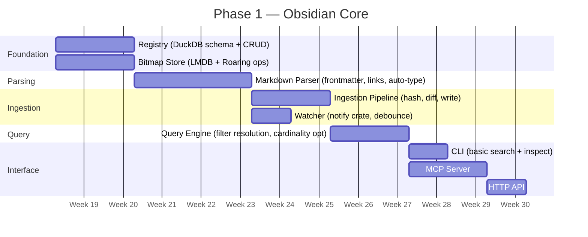

# BIEM Roadmap

> Status: **DRAFT — v1**
> Reference: `001-system-overview.md` for architecture details

## Phase 1 — Obsidian Core (Current Focus)

The minimal viable index: ingest an Obsidian vault, maintain bitmap indices, expose structured queries.

### Module Build Order

### Task Breakdown

#### 1. Foundation: Registry
- [ ] DuckDB schema (documents, chunks, bitmap_catalog, global_state)
- [ ] CRUD operations: assign_id, lookup, update, bulk_insert
- [ ] Config/state directory setup (`~/.biem/` global, `.biem/` local)
- [ ] `config.toml` vault registration
- [ ] Unit tests for all CRUD ops

#### 2. Foundation: Bitmap Store
- [ ] LMDB database setup with heed crate
- [ ] Roaring Bitmap serialization (portable format) via `roaring` crate
- [ ] Core operations: get, insert_id, remove_id, intersect, union, and_not
- [ ] Tombstone bitmap: insert, apply to queries
- [ ] Bitmap catalog sync (cardinality updates to DuckDB)
- [ ] Unit tests for all bitmap operations

#### 3. Parsing: Markdown Parser
- [ ] YAML frontmatter extraction (tags, aliases, custom fields)
- [ ] `[[wikilink]]` extraction (with alias support `[[target|display]]`)
- [ ] `[markdown](link)` extraction
- [ ] Header hierarchy → chunk boundaries (byte ranges)
- [ ] Auto-type detection (task list density, link density, etc.)
- [ ] Hierarchical tag flattening (`#a/b/c` → 3 tags)
- [ ] Parser trait implementation (`can_parse`, `parse`)
- [ ] Unit tests against sample vault files

#### 4. Ingestion: Pipeline
- [ ] BLAKE3 hashing for change detection
- [ ] Initial indexing: batch-then-flush mode (walk → parse all → bulk write)
- [ ] Incremental indexing: single-file update path
- [ ] Diff logic: detect added/changed/removed tags, links, type
- [ ] Bitmap update logic (add to new bitmaps, remove from stale ones)
- [ ] File delete → tombstone insertion
- [ ] File move → registry path update + folder bitmap update
- [ ] Integration tests: init a small vault, verify registry + bitmaps

#### 5. Ingestion: Watcher
- [ ] `notify` crate filesystem watcher
- [ ] Debounce (100ms default)
- [ ] Map fs events to `ChangeEvent { path, kind }`
- [ ] SourceFeed trait definition
- [ ] FsWatcher as first SourceFeed implementation
- [ ] Integration test: modify file, verify event fires

#### 6. Query Engine
- [ ] `QueryRequest` → bitmap catalog lookup for cardinality
- [ ] Cardinality-sorted intersection (smallest first)
- [ ] AND / OR / NOT filter composition
- [ ] Tombstone masking (`AND NOT _tombstone`)
- [ ] Registry resolution (IDs → MatchPointer with metadata)
- [ ] Limit/pagination
- [ ] Unit tests: synthetic bitmaps, verify intersection logic
- [ ] Integration tests: full pipeline (ingest → query → verify results)

#### 7. Interface: CLI
- [ ] `biem init <path> [--local]` — register vault, run initial index
- [ ] `biem config` — show/set configuration
- [ ] `biem status` — index health, document count, bitmap count
- [ ] `biem search --tag X --type Y [--op and|or]` — query with filters
- [ ] `biem inspect <file>` — show doc_id, tags, links, type, chunks
- [ ] `biem bitmaps [--category tag|folder|...]` — list bitmaps with cardinality
- [ ] `biem compact` — run tombstone cleanup
- [ ] Output formatting: table, JSON

#### 8. Interface: MCP Server
- [ ] MCP tool: `biem_search` (filters → MatchPointers)
- [ ] MCP tool: `biem_inspect` (file → metadata)
- [ ] MCP tool: `biem_status` (index health)
- [ ] MCP tool: `biem_bitmaps` (available filters for discovery)
- [ ] MCP resource: expose vault metadata as resource
- [ ] Integration test: MCP client → query → verify response

#### 9. Interface: HTTP API
- [ ] `POST /search` — same as CLI search
- [ ] `GET /status` — index health
- [ ] `GET /inspect/:path` — file metadata
- [ ] `GET /bitmaps` — list with cardinality
- [ ] JSON response format matching MatchPointer schema

---

## Phase 2 — Semantic Layer (Follow-on)

Add vector-based semantic search to complement the structural bitmap filtering.

### Planned Work
- [ ] Embedding model integration (BGE-M3 or Nomic-Embed)
- [ ] Qdrant integration with Binary Quantization (RaBitQ)
- [ ] Semantic scoring in QueryResult (`score` field)
- [ ] Query Engine: pass bitmap result mask to vector search
- [ ] Re-ranker integration (MiniLM or BGE-Reranker)
- [ ] Benchmarks: latency and recall vs pure bitmap search

### Performance & Scalability (Backlog)
- [ ] Parallel ingestion (thread pool with write coordination)
- [ ] Dataframe-based batch ingestion for very large vaults (Polars/Arrow)
- [ ] Catalog warm-up phase on service start (preload cardinality map, pre-calculate frequent intersections)

### Cognitive Features (Backlog)
- [ ] Contradiction detection (bit-pattern comparison)
- [ ] Implicit linkage / ghost links (shared bit-clusters)
- [ ] Dynamic MOC generation (graph centrality via bitmaps)

---

## Phase 3 — Code Intelligence (Future)

Extend BIEM to index codebases using Tree-Sitter.

### Planned Work
- [ ] CodeParser implementation (Tree-Sitter trait impl)
- [ ] AST-aware chunking (function, class, module scope)
- [ ] Semantic bits: `is_function`, `is_class`, `is_exported`, `has_side_effects`
- [ ] Multi-repo support: global ID namespace, repo bitmaps
- [ ] Cross-repo impact analysis (caller bitmaps)
- [ ] `biem init <repo-path> --type code`

---

## Phase 4 — Extended Sources (Future)

Support non-filesystem sources.

### Planned Work
- [ ] SourceFeed implementations: Confluence, Jira, Slack
- [ ] Webhook/polling-based ingestion
- [ ] Source-specific parsers
- [ ] Unified cross-source queries (`tag:work AND source:confluence`)

---

## Non-Functional Requirements

| Requirement | Target |
|------------|--------|
| Search latency (10k docs, 3 filters) | < 5ms |
| Memory footprint (10k docs indexed) | < 100MB |
| Initial index time (10k docs) | < 30s |
| Incremental update (single file) | < 50ms |
| Storage overhead | < 10% of vault size |
| Platform | macOS (primary), Linux |
