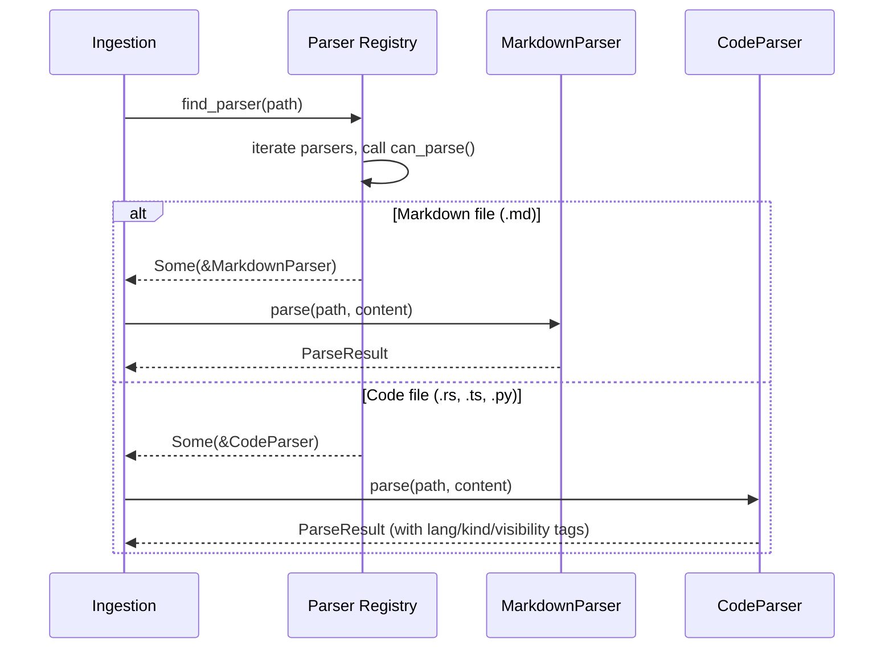
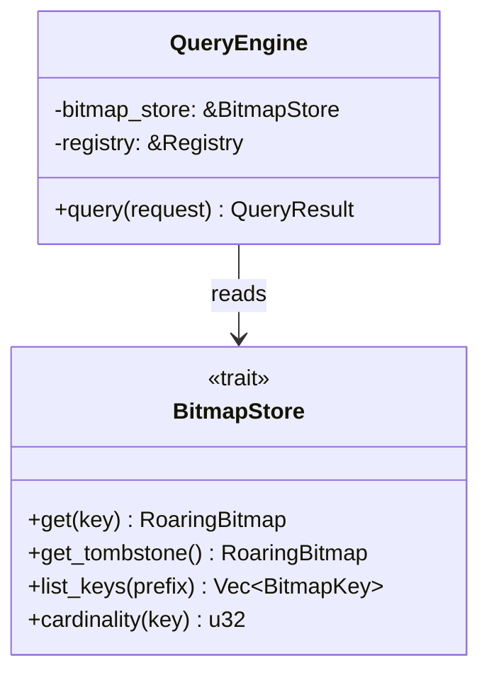
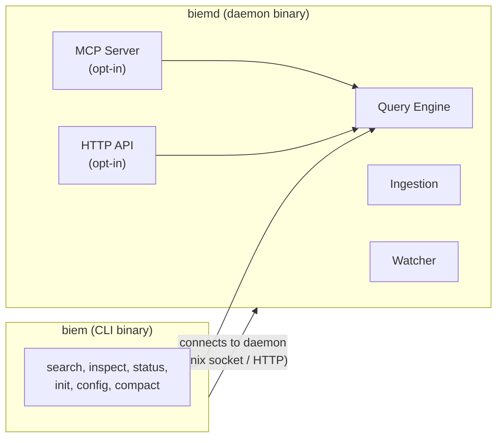
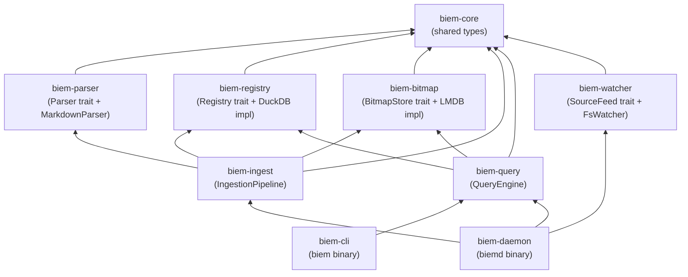

# BIEM Module Contracts

> Status: **Phase 1 — implemented and aligned with code**
> Reference: `001-system-overview.md` for architecture context
> Language: Rust
> Scope: Phase 1 — Obsidian core only

This document defines the Rust types and trait signatures at every module boundary. These are the **contracts** — the stable interfaces that modules depend on. Internal implementation details are not covered here.

---

## 1. Shared Types

Types used across multiple modules. These live in a `biem-core` crate.

```rust
use std::collections::HashMap;
use std::ops::Range;
use std::path::PathBuf;

/// Unique identifier for a document (file) in the index.
/// Monotonically increasing, assigned by the Registry.
pub type DocId = u32;

/// Unique identifier for a chunk within a document.
/// Monotonically increasing, assigned by the Registry.
pub type ChunkId = u32;

/// A namespaced key for a bitmap in the store.
/// Examples: "tag:work", "folder:/projects", "type:task", "link:ProjectAlpha"
pub type BitmapKey = String;

/// The source type of an indexed document.
#[derive(Debug, Clone, PartialEq, Eq)]
pub enum SourceType {
    Obsidian,
    // Future: Code, Confluence, etc.
}

/// Auto-detected note type based on structural analysis.
#[derive(Debug, Clone, PartialEq, Eq)]
pub enum NoteType {
    Note,       // Default — no strong structural signal
    Task,       // High density of [ ] / [x] items
    Moc,        // High density of [[links]], map-of-content pattern
    Reference,  // Has url/isbn/source in frontmatter
    // Future: Person, Meeting, etc.
}

/// The category of a bitmap key, for catalog queries.
#[derive(Debug, Clone, PartialEq, Eq)]
pub enum BitmapCategory {
    Tag,
    Folder,
    Link,
    Type,
    Source,
}

/// Timestamp as seconds since Unix epoch.
pub type Timestamp = i64;
```

---

## 2. Parser Contract

The parser is a **pure function** — no side effects, no state, no I/O beyond the bytes handed to it.

```rust
use std::path::Path;

/// A reference to another document (link target).
#[derive(Debug, Clone)]
pub struct LinkRef {
    /// The target as written in the source, e.g. "ProjectAlpha" from [[ProjectAlpha]]
    pub target: String,
    /// Optional display text, e.g. "my project" from [[ProjectAlpha|my project]]
    pub display: Option<String>,
    /// Byte position of the link in the source file
    pub byte_offset: usize,
}

/// A chunk boundary identified by the parser.
#[derive(Debug, Clone)]
pub struct Chunk {
    /// Byte range within the source file
    pub byte_range: Range<usize>,
    /// What kind of chunk this is
    pub kind: ChunkKind,
    /// Human-readable label (heading text, function name, class name)
    pub label: Option<String>,
    /// Nesting depth (heading depth for markdown, scope depth for code)
    pub depth: u8,
    /// Structured metadata specific to the chunk kind
    pub metadata: ChunkMetadata,
}

#[derive(Debug, Clone, PartialEq, Eq)]
pub enum ChunkKind {
    // Document chunks
    Section,        // Markdown section under a heading
    Frontmatter,    // YAML frontmatter block
    Body,           // Entire document body (no headings)

    // Code chunks
    Function,
    Method,
    Class,
    Module,
    Import,
    Constant,
}

/// Kind-specific metadata. Avoids polluting every chunk
/// with fields only relevant to one type.
#[derive(Debug, Clone, Default)]
pub struct ChunkMetadata {
    /// For code: function signature, class declaration line
    pub signature: Option<String>,
    /// For code: language identifier
    pub language: Option<String>,
    /// For code: visibility/export status
    pub visibility: Option<Visibility>,
}

#[derive(Debug, Clone, PartialEq, Eq)]
pub enum Visibility {
    Public,
    Private,
    Internal, // e.g., pub(crate) in Rust
}

/// The complete output of parsing a single file.
#[derive(Debug, Clone)]
pub struct ParseResult {
    /// Chunks identified in the file (at minimum, one chunk = the whole file)
    pub chunks: Vec<Chunk>,
    /// Tags extracted from frontmatter and inline (#tag)
    pub tags: Vec<String>,
    /// Links to other documents
    pub links: Vec<LinkRef>,
    /// Auto-detected document type, if confident enough
    pub auto_type: Option<DocType>,
    /// Parsed YAML frontmatter as key-value pairs
    pub frontmatter: HashMap<String, serde_json::Value>,
}

/// Trait that all parsers implement.
pub trait Parser: Send + Sync {
    /// Returns true if this parser can handle the given file path.
    /// Typically checks file extension.
    fn can_parse(&self, path: &Path) -> bool;

    /// Parse the file content and return structured metadata.
    /// Must not perform I/O — content is provided as bytes.
    fn parse(&self, path: &Path, content: &[u8]) -> Result<ParseResult, ParseError>;
}

#[derive(Debug, thiserror::Error)]
pub enum ParseError {
    #[error("invalid UTF-8 in file")]
    InvalidUtf8,
    #[error("malformed frontmatter: {0}")]
    BadFrontmatter(String),
    #[error("parser internal error: {0}")]
    Internal(String),
}
```

### How Ingestion uses the Parser



The ingestion pipeline holds a `Vec<Box<dyn Parser>>` (the "parser registry") and selects the first parser that returns `true` for `can_parse`.

### Code Parser (biem-code)

The `CodeParser` uses Tree-sitter grammars for AST-aware chunking. Currently supports:

| Language | Extensions | Grammar |
|----------|-----------|---------|
| Rust | `.rs` | `tree-sitter-rust` |
| TypeScript | `.ts`, `.tsx` | `tree-sitter-typescript` |
| JavaScript | `.js`, `.jsx` | `tree-sitter-typescript` (TSX grammar) |
| Python | `.py` | `tree-sitter-python` |

**Code-specific bitmap keys** generated during ingestion:

| Key pattern | Example | Source |
|-------------|---------|--------|
| `lang:<language>` | `lang:rust`, `lang:typescript` | File extension |
| `kind:<kind>` | `kind:function`, `kind:method`, `kind:class` | AST node type |
| `visibility:<vis>` | `visibility:public`, `visibility:private` | Visibility modifier / export |
| `async:true` | `async:true` | Async function detection |
| `import:<module>` | `import:serde`, `import:react` | Use/import statements |
| `type:<doc_type>` | `type:source_file`, `type:test_file` | Path convention detection |
| `convention:<tag>` | `convention:fixture`, `convention:route` | Python decorators |

---

## 3. Registry Contract

The registry is a pluggable storage backend. All access goes through this trait. DuckDB is the first implementation.

```rust
/// A document record in the registry.
#[derive(Debug, Clone)]
pub struct DocRecord {
    pub doc_id: DocId,
    pub file_path: PathBuf,
    pub source_type: SourceType,
    pub blake3_hash: [u8; 32],
    pub last_indexed: Timestamp,
    pub auto_type: Option<NoteType>,
}

/// A chunk record in the registry.
#[derive(Debug, Clone)]
pub struct ChunkRecord {
    pub chunk_id: ChunkId,
    pub doc_id: DocId,
    pub kind: ChunkKind,
    pub byte_start: u32,
    pub byte_end: u32,
    pub label: Option<String>,
    pub depth: u8,
    pub metadata: ChunkMetadata,
}

/// Metadata about a bitmap, stored in the catalog.
#[derive(Debug, Clone)]
pub struct BitmapCatalogEntry {
    pub bitmap_key: BitmapKey,
    pub category: BitmapCategory,
    pub cardinality: u32,
    pub last_updated: Timestamp,
}

/// Input for registering a new document.
pub struct NewDoc {
    pub file_path: PathBuf,
    pub source_type: SourceType,
    pub blake3_hash: [u8; 32],
    pub auto_type: Option<NoteType>,
}

/// Input for registering chunks belonging to a document.
pub struct NewChunk {
    pub doc_id: DocId,
    pub kind: ChunkKind,
    pub byte_start: u32,
    pub byte_end: u32,
    pub label: Option<String>,
    pub depth: u8,
    pub metadata: ChunkMetadata,
}

pub trait Registry: Send + Sync {
    // --- Document operations ---

    /// Assign a new doc_id and insert the document. Returns the assigned DocId.
    fn insert_doc(&mut self, doc: NewDoc) -> Result<DocId, RegistryError>;

    /// Bulk insert documents in a single transaction. Returns assigned DocIds in order.
    fn bulk_insert_docs(&mut self, docs: Vec<NewDoc>) -> Result<Vec<DocId>, RegistryError>;

    /// Look up a document by file path.
    fn lookup_by_path(&self, path: &Path) -> Result<Option<DocRecord>, RegistryError>;

    /// Look up a document by ID.
    fn lookup_by_id(&self, doc_id: DocId) -> Result<Option<DocRecord>, RegistryError>;

    /// Look up multiple documents by their IDs.
    fn lookup_by_ids(&self, doc_ids: &[DocId]) -> Result<Vec<DocRecord>, RegistryError>;

    /// Update the hash, timestamp, and auto_type for an existing document.
    fn update_doc(&mut self, doc_id: DocId, hash: [u8; 32], auto_type: Option<NoteType>) -> Result<(), RegistryError>;

    /// Update the file path for an existing document (file move/rename).
    fn update_path(&mut self, doc_id: DocId, new_path: PathBuf) -> Result<(), RegistryError>;

    /// Delete a document and all its chunks from the registry.
    /// Used by compaction to permanently remove tombstoned documents.
    fn delete_doc(&mut self, doc_id: DocId) -> Result<(), RegistryError>;

    // --- Chunk operations ---

    /// Replace all chunks for a document (delete old, insert new).
    fn replace_chunks(&mut self, doc_id: DocId, chunks: Vec<NewChunk>) -> Result<Vec<ChunkId>, RegistryError>;

    /// Get all chunks for a document.
    fn get_chunks(&self, doc_id: DocId) -> Result<Vec<ChunkRecord>, RegistryError>;

    // --- Bitmap catalog ---

    /// Upsert a bitmap catalog entry (set cardinality + timestamp).
    fn upsert_catalog_entry(&mut self, entry: BitmapCatalogEntry) -> Result<(), RegistryError>;

    /// Bulk upsert bitmap catalog entries.
    fn bulk_upsert_catalog(&mut self, entries: Vec<BitmapCatalogEntry>) -> Result<(), RegistryError>;

    /// Get a catalog entry by key.
    fn get_catalog_entry(&self, key: &str) -> Result<Option<BitmapCatalogEntry>, RegistryError>;

    /// Get all catalog entries, optionally filtered by category.
    fn list_catalog(&self, category: Option<BitmapCategory>) -> Result<Vec<BitmapCatalogEntry>, RegistryError>;

    // --- Global state ---

    /// Get all documents in the registry (for idempotent bulk re-indexing).
    fn list_all_docs(&self) -> Result<Vec<DocRecord>, RegistryError>;

    /// Get the current global state (next IDs, totals).
    fn get_global_state(&self) -> Result<GlobalState, RegistryError>;
}

#[derive(Debug, Clone)]
pub struct GlobalState {
    pub next_doc_id: DocId,
    pub next_chunk_id: ChunkId,
    pub total_documents: u32,
}

#[derive(Debug, thiserror::Error)]
pub enum RegistryError {
    #[error("document not found: {0}")]
    NotFound(DocId),
    #[error("path already registered: {0}")]
    DuplicatePath(PathBuf),
    #[error("database error: {0}")]
    Database(String),
}
```

---

## 4. Bitmap Store Contract

The bitmap store owns the LMDB database and all Roaring Bitmap operations.

```rust
use roaring::RoaringBitmap;

pub trait BitmapStore: Send + Sync {
    // --- Single bitmap operations ---

    /// Get a bitmap by key. Returns an empty bitmap if the key doesn't exist.
    fn get(&self, key: &str) -> Result<RoaringBitmap, BitmapError>;

    /// Write a bitmap to the store (full replace), serialized in portable format.
    fn put(&mut self, key: &str, bitmap: &RoaringBitmap) -> Result<(), BitmapError>;

    /// Insert a single doc_id into a bitmap (deserialize → insert → serialize).
    fn insert_id(&mut self, key: &str, doc_id: DocId) -> Result<(), BitmapError>;

    /// Remove a single doc_id from a bitmap.
    fn remove_id(&mut self, key: &str, doc_id: DocId) -> Result<(), BitmapError>;

    /// Delete a bitmap key entirely.
    fn delete(&mut self, key: &str) -> Result<(), BitmapError>;

    /// Check if a bitmap key exists.
    fn exists(&self, key: &str) -> bool;

    // --- Batch operations (for initial indexing) ---

    /// Write multiple bitmaps in a single LMDB transaction.
    fn bulk_put(&mut self, entries: Vec<(BitmapKey, RoaringBitmap)>) -> Result<(), BitmapError>;

    // --- Tombstone operations ---

    /// Add a doc_id to the tombstone bitmap.
    fn tombstone(&mut self, doc_id: DocId) -> Result<(), BitmapError>;

    /// Get the current tombstone bitmap.
    fn get_tombstone(&self) -> Result<RoaringBitmap, BitmapError>;

    /// Clear the tombstone bitmap entirely (used by compaction).
    fn clear_tombstone(&mut self) -> Result<(), BitmapError>;

    // --- Query helpers ---

    /// List all bitmap keys, optionally filtered by prefix (e.g. "tag:").
    fn list_keys(&self, prefix: Option<&str>) -> Result<Vec<BitmapKey>, BitmapError>;

    /// Get the cardinality of a bitmap without deserializing the full bitmap.
    /// Falls back to deserialize + len() if format doesn't support it.
    fn cardinality(&self, key: &str) -> Result<u32, BitmapError>;

    // --- Jaccard similarity ---

    /// Compute Jaccard similarity between two bitmap keys: |A ∩ B| / |A ∪ B|.
    /// Returns 0.0 if both bitmaps are empty, 1.0 if identical.
    fn jaccard_keys(&self, key_a: &str, key_b: &str) -> Result<f64, BitmapError>;

    /// Compute Jaccard similarity between two pre-loaded bitmaps.
    fn jaccard_bitmaps(&self, a: &RoaringBitmap, b: &RoaringBitmap) -> f64;
}

#[derive(Debug, thiserror::Error)]
pub enum BitmapError {
    #[error("LMDB error: {0}")]
    Storage(String),
    #[error("serialization error: {0}")]
    Serialization(String),
}
```

### Bitmap operations used by the Query Engine

The query engine doesn't call `insert_id` or `put` — it only reads. This is the read-only surface:



---

## 4b. Enrichment Contract (Phase 2 — Workstream 1)

The enrichment pipeline runs after parsing and before bitmap writes. It produces inferred bitmap keys via pluggable taggers, cached per file content hash.

```rust
/// Result from a single tagger run.
#[derive(Debug, Clone, Serialize, Deserialize)]
pub struct TaggerResult {
    pub tagger_name: String,
    pub tags: Vec<String>,
    pub confidence: Option<f32>,  // 0.0–1.0, None for rule-based taggers
}

/// Combined enrichment output for a document, stored in cache.
#[derive(Debug, Clone, Serialize, Deserialize)]
pub struct EnrichmentCache {
    pub content_hash: String,       // blake3 hex
    pub tagger_config_hash: String, // blake3 hex, for invalidation
    pub results: Vec<TaggerResult>,
    pub timestamp: Timestamp,
}
```

```rust
/// A tagger produces additional bitmap keys from a parse result.
/// Taggers are pure functions — no filesystem I/O.
pub trait Tagger: Send + Sync {
    fn name(&self) -> &str;
    fn applies_to(&self, source: &SourceType) -> bool;
    fn tag(
        &self,
        path: &Path,
        content: &[u8],
        parse_result: &ParseResult,
    ) -> Result<TaggerResult, EnrichError>;
}

/// Cache for tagger results, keyed by content hash.
pub trait TaggerCache: Send + Sync {
    fn get(&self, content_hash: &str) -> Result<Option<EnrichmentCache>, EnrichError>;
    fn put(&self, cache: &EnrichmentCache) -> Result<(), EnrichError>;
    fn invalidate_tagger(&mut self, tagger_name: &str) -> Result<(), EnrichError>;
}

#[derive(Debug, thiserror::Error)]
pub enum EnrichError {
    #[error("tagger '{0}' failed: {1}")]
    TaggerFailed(String, String),
    #[error("cache I/O error: {0}")]
    CacheIo(String),
    #[error("cache serialization error: {0}")]
    CacheSerialization(String),
}
```

### BitmapCategory additions

```rust
pub enum BitmapCategory {
    Tag, Folder, Link, Type, Source,
    Enrichment,  // inferred keys from taggers (topic:*, complexity:*, etc.)
    Code,        // keys from code parser (lang:*, kind:*, etc.)
    Custom,      // keys from user-defined YAML taggers
}
```

Inferred tags are indexed as regular bitmap keys (e.g. `topic:auth`, `size:small`). The `Enrichment` category is used in the bitmap catalog for discovery and filtering via `biem bitmaps --category enrichment`.

---

## 5. Ingestion Contract

Ingestion orchestrates parsers, the registry, and the bitmap store. It doesn't have a trait — it's a concrete coordinator. But it has well-defined inputs and outputs.

```rust
/// A filesystem change event from the watcher.
#[derive(Debug, Clone)]
pub struct ChangeEvent {
    pub path: PathBuf,
    pub kind: ChangeKind,
}

#[derive(Debug, Clone, PartialEq, Eq)]
pub enum ChangeKind {
    Created,
    Modified,
    Deleted,
    Renamed { from: PathBuf },
}

/// Summary of what ingestion did for a single event.
#[derive(Debug, Clone)]
pub struct IngestResult {
    pub action: IngestAction,
    pub bitmaps_updated: u32,
}

#[derive(Debug, Clone, PartialEq, Eq)]
pub enum IngestAction {
    Indexed,          // New file, fully indexed
    Updated,          // Existing file, content changed
    Moved,            // File renamed/moved, path updated
    Tombstoned,       // File deleted, added to tombstone
    Skipped,          // Hash unchanged, nothing to do
}

/// The ingestion pipeline. Concrete struct, not a trait.
pub struct IngestionPipeline {
    parsers: Vec<Box<dyn Parser>>,
    registry: Box<dyn Registry>,
    bitmap_store: Box<dyn BitmapStore>,
}

impl IngestionPipeline {
    /// Process a single change event (incremental mode).
    pub fn process_event(&mut self, event: &ChangeEvent) -> Result<IngestResult, IngestError>;

    /// Perform initial bulk indexing of an entire directory tree.
    /// Uses batch-then-flush strategy for performance.
    pub fn bulk_index(&mut self, root: &Path) -> Result<BulkIndexResult, IngestError>;

    /// Remove tombstoned doc IDs from all bitmaps, delete from registry,
    /// and clear the tombstone bitmap. Returns a compaction summary.
    pub fn compact(&mut self) -> Result<CompactResult, IngestError>;

    /// Decompose the pipeline into its owned parts for handoff (e.g. to a query engine).
    pub fn into_parts(self) -> (Vec<Box<dyn Parser>>, Box<dyn Registry>, Box<dyn BitmapStore>);
}

#[derive(Debug, Clone)]
pub struct BulkIndexResult {
    pub docs_indexed: u32,
    pub bitmaps_created: u32,
    pub duration_ms: u64,
}

#[derive(Debug, Clone, serde::Serialize)]
pub struct CompactResult {
    pub docs_removed: u32,
    pub bitmaps_cleaned: u32,
    pub duration_ms: u64,
}

#[derive(Debug, thiserror::Error)]
pub enum IngestError {
    #[error("no parser found for: {0}")]
    NoParser(PathBuf),
    #[error(transparent)]
    Parse(#[from] ParseError),
    #[error(transparent)]
    Registry(#[from] RegistryError),
    #[error(transparent)]
    Bitmap(#[from] BitmapError),
    #[error("I/O error: {0}")]
    Io(#[from] std::io::Error),
}
```

### Ingestion logic for bitmap updates (incremental)

When a file is modified, ingestion must diff the old and new parse results to update bitmaps correctly:

```
old_tags = registry.get_doc_tags(doc_id)     // from previous parse
new_tags = parse_result.tags                  // from current parse

added   = new_tags - old_tags   → insert doc_id into these bitmaps
removed = old_tags - new_tags   → remove doc_id from these bitmaps
```

Same logic applies to links and auto_type. This diff is internal to the ingestion pipeline.

---

## 6. Watcher / SourceFeed Contract

```rust
use std::sync::mpsc;

/// Trait for any source of change events.
/// Filesystem watcher is the first implementation.
pub trait SourceFeed: Send {
    /// Start watching. Sends events to the provided channel.
    /// Blocks until stop() is called or an error occurs.
    fn start(&mut self, tx: mpsc::Sender<ChangeEvent>) -> Result<(), WatchError>;

    /// Signal the feed to stop.
    fn stop(&mut self) -> Result<(), WatchError>;
}

/// Configuration for the filesystem watcher.
pub struct FsWatcherConfig {
    /// Root path to watch
    pub root: PathBuf,
    /// Debounce duration in milliseconds
    pub debounce_ms: u64,
    /// Glob patterns to ignore (e.g. ".obsidian/**", ".biem/**")
    pub ignore_patterns: Vec<String>,
}

#[derive(Debug, thiserror::Error)]
pub enum WatchError {
    #[error("watch error: {0}")]
    Watch(String),
    #[error("IO error: {0}")]
    Io(#[from] std::io::Error),
}
```

---

## 7. Query Engine Contract

```rust
/// A filter expression in a query.
#[derive(Debug, Clone)]
pub enum Filter {
    /// Match a single bitmap key, e.g. Filter::Key("tag:work")
    Key(BitmapKey),
    /// Boolean NOT of a filter
    Not(Box<Filter>),
    /// Boolean AND of multiple filters
    And(Vec<Filter>),
    /// Boolean OR of multiple filters
    Or(Vec<Filter>),
}

/// A query request from any interface (CLI, MCP, HTTP).
#[derive(Debug, Clone)]
pub struct QueryRequest {
    /// The filter expression to resolve
    pub filter: Filter,
    /// Maximum number of results to return
    pub limit: Option<u32>,
    /// Offset for pagination
    pub offset: Option<u32>,
}

/// A single match result — a pointer to relevant content.
#[derive(Debug, Clone, serde::Serialize)]
pub struct MatchPointer {
    pub doc_id: DocId,
    pub file_path: PathBuf,
    pub source_type: String,
    pub chunks: Vec<ChunkPointer>,
    pub matched_filters: Vec<BitmapKey>,
    pub auto_type: Option<String>,
    pub score: Option<f32>,         // Future: semantic score
    pub last_modified: Timestamp,
}

/// A pointer to a specific chunk within a document.
#[derive(Debug, Clone, serde::Serialize)]
pub struct ChunkPointer {
    pub chunk_id: ChunkId,
    pub kind: String,           // Serialized ChunkKind
    pub byte_start: u32,
    pub byte_end: u32,
    pub label: Option<String>,
}

/// The result of a query.
#[derive(Debug, serde::Serialize)]
pub struct QueryResult {
    pub matches: Vec<MatchPointer>,
    pub total_matching: u32,        // Total before limit/offset
    pub query_time_us: u64,         // Microseconds
}

/// The result of inspecting a single document in the index.
#[derive(Debug, Clone, serde::Serialize)]
pub struct InspectResult {
    pub doc_id: DocId,
    pub file_path: PathBuf,
    pub source_type: String,
    pub auto_type: Option<String>,
    pub blake3_hash: String,
    pub last_indexed: Timestamp,
    pub chunks: Vec<ChunkPointer>,
    pub bitmap_keys: Vec<BitmapKey>,
}

/// Summary status of the entire index.
#[derive(Debug, Clone, serde::Serialize)]
pub struct IndexStatus {
    pub total_documents: u32,
    pub total_bitmaps: usize,
    pub tombstoned: u64,
    pub next_doc_id: DocId,
    pub next_chunk_id: ChunkId,
}

/// A filter entry for discovery (key + cardinality).
#[derive(Debug, Clone, serde::Serialize)]
pub struct FilterEntry {
    pub key: BitmapKey,
    pub cardinality: u32,
}

pub trait QueryEngine: Send + Sync {
    /// Execute a bitmap filter query, returning matching document pointers.
    fn query(&self, request: QueryRequest) -> Result<QueryResult, QueryError>;

    /// List available bitmap keys for filter discovery.
    /// Consumers (especially LLMs) need to know what filters exist.
    fn list_filters(&self, category: Option<BitmapCategory>) -> Result<Vec<BitmapCatalogEntry>, QueryError>;

    /// Inspect a single file in the index by path.
    fn inspect(&self, path: &Path) -> Result<Option<InspectResult>, QueryError>;

    /// Get summary status of the index.
    fn status(&self) -> Result<IndexStatus, QueryError>;

    /// List available filter keys with cardinality, optionally by category prefix.
    fn list_filter_keys(&self, category: Option<&str>) -> Result<Vec<FilterEntry>, QueryError>;
}

#[derive(Debug, thiserror::Error)]
pub enum QueryError {
    #[error("unknown bitmap key: {0}")]
    UnknownFilter(BitmapKey),
    #[error(transparent)]
    Bitmap(#[from] BitmapError),
    #[error(transparent)]
    Registry(#[from] RegistryError),
}
```

### Filter resolution example

A query for "tasks tagged work but not archived":

```rust
let request = QueryRequest {
    filter: Filter::And(vec![
        Filter::Key("tag:work".into()),
        Filter::Key("type:task".into()),
        Filter::Not(Box::new(Filter::Key("folder:/archive".into()))),
    ]),
    limit: Some(10),
    offset: None,
};
```

Resolved by the engine as:
```
result = bitmap("tag:work") AND bitmap("type:task") AND NOT bitmap("folder:/archive")
result = result AND NOT bitmap("_tombstone")
```

---

## 8. Interface Layer Contracts

The interface layer translates protocol-specific requests into `QueryRequest` and `QueryResult`. Each interface is thin.

### 8.1 MCP Tools

```rust
/// MCP tool definitions exposed by BIEM.
/// These map directly to QueryEngine methods.

// Tool: biem_search
// Input:  { filters: [{ key: "tag:work" }, { key: "type:task" }], op: "and", limit: 10 }
// Output: QueryResult serialized as JSON

// Tool: biem_inspect
// Input:  { file_path: "/path/to/note.md" }
// Output: DocRecord + chunks + associated bitmap keys

// Tool: biem_status
// Input:  {}
// Output: { total_documents, total_bitmaps, tombstoned, last_indexed }

// Tool: biem_filters
// Input:  { category: "tag" }  (optional)
// Output: Vec<BitmapCatalogEntry> — available filters for discovery
```

### 8.2 CLI Commands

```
biem search --filter "tag:work AND type:task AND NOT folder:/archive" --limit 10
biem search --tag work --type task --limit 10       # shorthand
biem inspect /path/to/note.md
biem status
biem filters [--category tag|folder|link|type]
biem bitmaps                                         # alias for filters
biem init <path> [--local]
biem config [--storage local|global]
biem compact
```

### 8.3 HTTP API

```
POST /v1/search     body: QueryRequest    → QueryResult
GET  /v1/inspect    ?path=...             → DocRecord + chunks
GET  /v1/status                           → index health
GET  /v1/filters    ?category=tag         → Vec<BitmapCatalogEntry>
```

---

## 9. Module Dependency Graph

See §11 Q4 for the updated dependency graph and crate structure.

---

## 10. Crate Structure (Proposed)

```
biem/
├── Cargo.toml              # workspace root
├── crates/
│   ├── biem-core/          # shared types, error types
│   ├── biem-parser/        # Parser trait + MarkdownParser
│   ├── biem-registry/      # Registry trait + DuckDB implementation
│   ├── biem-bitmap/        # BitmapStore trait + LMDB implementation
│   ├── biem-ingest/        # IngestionPipeline
│   ├── biem-watcher/       # SourceFeed trait + FsWatcher
│   ├── biem-query/         # QueryEngine
│   ├── biem-cli/           # `biem` binary
│   └── biem-daemon/        # `biemd` binary (watcher + optional MCP/HTTP)
├── docs/
│   └── architecture/
└── tests/                  # Integration tests
    └── fixtures/           # Sample vault files for testing
```

---

## 11. Resolved Design Decisions

### Q1: Trait objects vs generics

**Context**: In Rust, there are two ways to use traits:
- **Generics** (`fn process<R: Registry>(reg: &R)`) — the compiler generates specialised code for each concrete type. Zero runtime overhead (no virtual dispatch), but every consumer must be generic too, which "infects" upward through the call stack.
- **Trait objects** (`fn process(reg: &dyn Registry)`) — one compiled function, dispatches via vtable pointer at runtime. Tiny overhead (~1-2ns per call), but much simpler code.

**Comparison for BIEM**:

| Factor | Generics | Trait objects |
|--------|----------|---------------|
| Performance | Zero-cost dispatch | ~1-2ns vtable overhead per call |
| Code complexity | Every struct/fn that touches Registry or BitmapStore becomes generic — `IngestionPipeline<R: Registry, B: BitmapStore, P: Parser>` cascades everywhere | Clean, non-generic structs |
| Compile times | Longer — monomorphisation generates code per type combination | Shorter — one version per function |
| Pluggability | Must know all types at compile time | Can swap implementations at runtime (e.g., test mocks) |
| Testing | Need generic test helpers or concrete types | Easy to mock — just implement the trait |

**The Scala parallel**: If you're used to Scala, trait objects are like using `trait Registry` with standard subtyping (`impl: DuckDbRegistry extends Registry`). Generics are like Scala's `F[_]` / tagless final style — powerful but adds complexity at every layer.

**Decision: Trait objects (`Box<dyn Trait>` / `Arc<dyn Trait>`) for v1.**

Reasons:
1. BIEM's hot path is bitmap intersection and LMDB reads — measured in microseconds. A 1-2ns vtable dispatch is noise.
2. It makes testing dramatically easier — mock Registry and BitmapStore without generics gymnastics.
3. The code stays readable for a v1. You can always switch a specific hot path to generics later if profiling shows it matters.
4. With only one implementation per trait in Phase 1, there's no compile-time benefit from generics anyway.

**Roadmap**: If profiling later shows vtable dispatch in the query engine hot loop is measurable (unlikely), refactor `BitmapStore::get` to a generic. Estimated effort: small — one crate boundary change, no cascading.

### Q2: Error strategy

**Decision: Per-module errors with `thiserror`, plus structured logging via `tracing`.**

Each module defines its own error enum:
```rust
// biem-registry
#[derive(Debug, thiserror::Error)]
pub enum RegistryError { ... }

// biem-bitmap
#[derive(Debug, thiserror::Error)]
pub enum BitmapError { ... }
```

Higher-level modules (ingestion, query engine) define errors that wrap lower-level ones:
```rust
// biem-ingest
#[derive(Debug, thiserror::Error)]
pub enum IngestError {
    #[error("registry: {0}")]
    Registry(#[from] RegistryError),
    #[error("bitmap: {0}")]
    Bitmap(#[from] BitmapError),
    #[error("parse: {0}")]
    Parse(#[from] ParseError),
    ...
}
```

The `#[from]` attribute auto-generates `From` conversions, so `?` propagation works naturally across module boundaries. This is idiomatic Rust — no unified error enum, no `anyhow` in library crates.

**Logging**: Use the `tracing` crate throughout. It's the Rust ecosystem standard and supports:
- Structured key-value fields (not just string messages)
- Spans (trace a single ingestion event through parse → registry → bitmap)
- Multiple subscribers (stdout for CLI, JSON for daemon, filtering by module)

```rust
use tracing::{info, warn, instrument};

#[instrument(skip(content))]
fn process_event(&mut self, event: ChangeEvent) -> Result<IngestResult, IngestError> {
    info!(path = %event.path.display(), kind = ?event.kind, "processing change");
    // ...
    warn!(doc_id = id, "file hash unchanged, skipping");
}
```

Each crate uses `tracing` for instrumentation. The binary crates (CLI, daemon) configure the subscriber (format, level, output).

### Q3: Sync vs Async + Storage pluggability

**Decision: Sync core, async at the interface boundary. Registry trait is pluggable (DuckDB first). BitmapStore trait is pluggable but LMDB is the only practical option.**

**Sync/async boundary**:
- `Registry`, `BitmapStore`, `QueryEngine`, `IngestionPipeline` — all synchronous
- The daemon process runs a tokio runtime for MCP/HTTP
- MCP/HTTP handlers call into sync code via `tokio::task::spawn_blocking`

This is clean because DuckDB and LMDB are both fundamentally synchronous (direct memory-mapped I/O). Wrapping them in async would add complexity with no benefit.

**Registry pluggability** — yes, makes sense:

The `Registry` trait (§3 of this doc) is already abstract. `DuckDbRegistry` is the first implementation. Possible future alternatives:

| Backend | Why you might want it |
|---------|----------------------|
| DuckDB | Columnar, great for analytical queries on catalog, bulk inserts |
| SQLite | Lighter weight, single-file, well-understood |
| chDB | Native Roaring Bitmap SQL functions (explored in Gemini docs) |

The trait boundary is already there — swapping is just a new crate implementing `Registry`.

**BitmapStore pluggability** — trait is pluggable, but alternatives are limited:

| Backend | Viable? | Notes |
|---------|---------|-------|
| LMDB (heed) | ✅ Primary | Memory-mapped, zero-copy reads, ACID, mature |
| RocksDB | ⚠️ Possible | Write-optimised (LSM), but heavier footprint, no memory-mapping advantage for reads |
| Sled | ⚠️ Possible | Pure Rust, but less mature, uncertain maintenance |
| Plain files | ⚠️ MVP only | One file per bitmap — simplest, but no transactions, no atomicity |
| In-memory only | ⚠️ Testing | Good for unit tests, not persistent |

LMDB is the right choice because:
1. Memory-mapped reads = zero-copy bitmap deserialisation
2. ACID transactions for multi-bitmap writes during ingestion
3. Tiny footprint (~100KB binary)
4. The `heed` crate is well-maintained and ergonomic

The trait exists for testability (in-memory mock) more than for swapping backends. But if someone needed RocksDB for write-heavy workloads, the door is open.

### Q4: Binary layout + daemon architecture

**Decision: Two binaries — `biem` (CLI) and `biemd` (daemon). Daemon runs watcher + ingestion and optionally exposes MCP and HTTP.**



**How it works**:

```
biemd                           # start daemon (watcher + ingestion)
biemd --mcp                     # start daemon + MCP server
biemd --http                    # start daemon + HTTP API
biemd --mcp --http              # start daemon + both

biem search --tag work          # CLI talks to running daemon
biem init /path/to/vault        # registers vault, daemon picks it up
biem status                     # queries daemon for index health
```

**Why two binaries**:
- The daemon is a long-running background process (watcher, ingestion, optional servers). It holds the LMDB and DuckDB connections open.
- The CLI is a short-lived process that sends a request and exits. It connects to the daemon to query.
- This avoids the CLI needing to open its own database connections (which could conflict with the daemon's locks).

**CLI fallback for development**: During early development (before the daemon exists), the CLI can open databases directly in "standalone" mode. This lets us build and test the foundation crates without needing the daemon yet.

```
biem search --tag work                    # connects to daemon (default)
biem search --tag work --standalone       # opens DB directly (dev mode)
```

**Is it difficult to change later?** No. The key insight is that both `biem` and `biemd` depend on the same `biem-query` crate. The binary layout is just plumbing — which binary instantiates the query engine. Merging them into a single binary later (or splitting further) is a half-day refactor because the actual logic lives in library crates.

**Updated crate structure**:

```
biem/
├── Cargo.toml                  # workspace root
├── crates/
│   ├── biem-core/              # shared types, errors
│   ├── biem-parser/            # Parser trait + MarkdownParser
│   ├── biem-registry/          # Registry trait + DuckDB impl
│   ├── biem-bitmap/            # BitmapStore trait + LMDB impl
│   ├── biem-ingest/            # IngestionPipeline
│   ├── biem-watcher/           # SourceFeed trait + FsWatcher
│   ├── biem-query/             # QueryEngine
│   ├── biem-cli/               # `biem` binary
│   └── biem-daemon/            # `biemd` binary (watcher + optional MCP/HTTP)
├── docs/
│   └── architecture/
└── tests/
    └── fixtures/               # Sample vault files for testing
```

**Updated dependency graph**:



---

## Semantic Layer (`biem-core/src/semantic.rs`)

### Types

```rust
pub type EmbeddingVector = Vec<f32>;

pub enum ScoreSource {
    CosineSimilarity,
    Reranker(String),
}

pub struct ScoredPointer {
    pub pointer: MatchPointer,
    pub chunk_id: ChunkId,
    pub score: f32,
    pub score_source: ScoreSource,
}

pub struct SemanticQueryRequest {
    pub filter: Filter,          // mandatory bitmap pre-filter
    pub query_text: String,
    pub top_k: usize,
    pub rerank: bool,
}

pub struct SemanticQueryResult {
    pub pointers: Vec<ScoredPointer>,
    pub bitmap_candidates: u32,
    pub vector_searched: u32,
    pub elapsed_bitmap_us: u64,
    pub elapsed_vector_us: u64,
    pub elapsed_rerank_us: u64,
}
```

### Traits

```rust
pub trait Embedder: Send + Sync {
    fn embed(&self, texts: &[&str]) -> Result<Vec<EmbeddingVector>, EmbedError>;
    fn dimension(&self) -> usize;
}

pub trait VectorStore: Send + Sync {
    fn upsert(&self, chunk_id: ChunkId, vector: &EmbeddingVector) -> Result<(), VectorError>;
    fn delete(&self, chunk_id: ChunkId) -> Result<(), VectorError>;
    fn search_within(
        &self,
        query: &EmbeddingVector,
        candidate_chunk_ids: &[ChunkId],
        top_k: usize,
    ) -> Result<Vec<(ChunkId, f32)>, VectorError>;
}

pub trait Reranker: Send + Sync {
    fn rerank(
        &self,
        query: &str,
        candidates: &[(ChunkId, &str)],
    ) -> Result<Vec<(ChunkId, f32)>, RerankError>;
}
```

#### Implementations

| Struct | Crate | Backend | Notes |
|---|---|---|---|
| `FastEmbedReranker` | `biem-embed` | fastembed ONNX cross-encoder | BGE-Reranker-Base default (~140MB model), local inference |

### Key contract

**Bitmap filter is mandatory for semantic queries.** There is no "search everything" mode — vector search is always scoped to bitmap-pre-filtered candidates. This keeps vector search fast and focused.

**Reranking is optional.** When `SemanticQueryRequest.rerank = true` and a `Reranker` is provided, the query engine reads chunk content from source files and re-scores via cross-encoder. Chunk text is resolved from disk using registry metadata (doc path + byte offsets).
