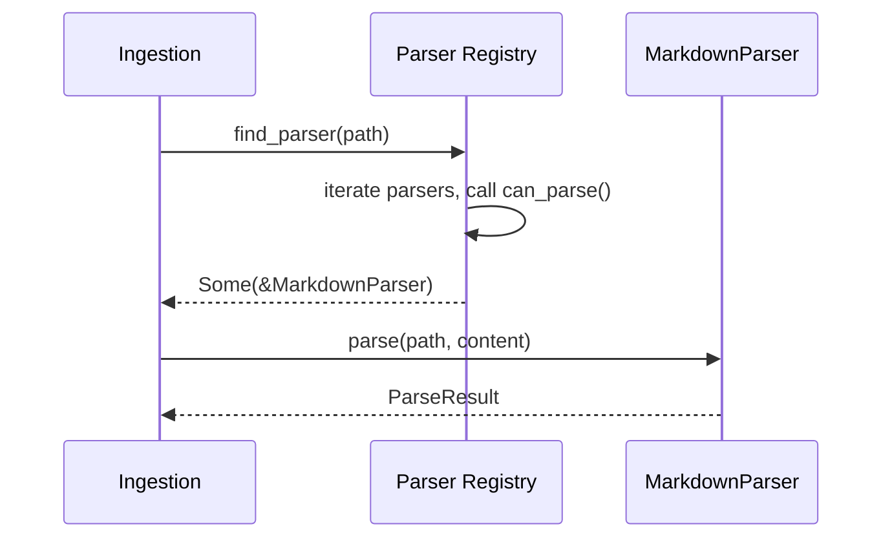
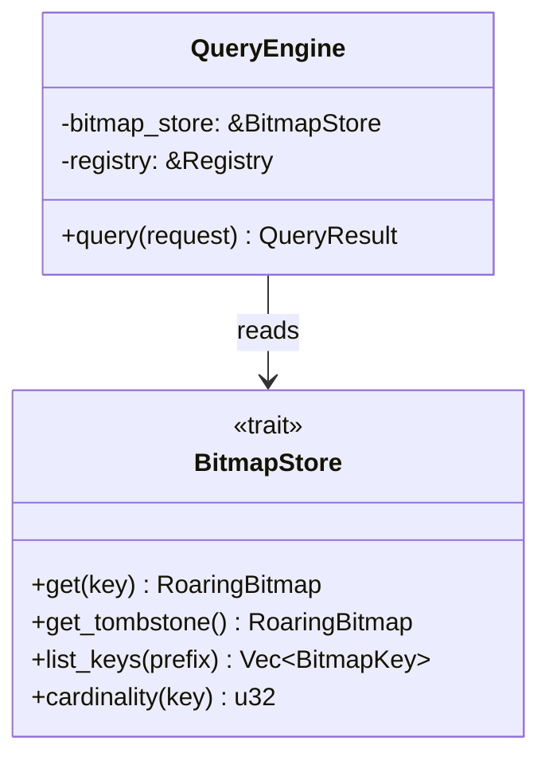
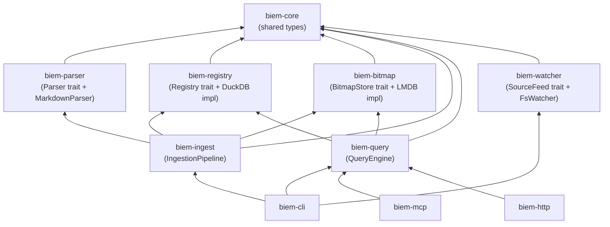

# BIEM Module Contracts

> Status: **DRAFT — v1**
> Reference: `001-system-overview.md` for architecture context
> Language: Rust
> Scope: Phase 1 — Obsidian core only

This document defines the Rust types and trait signatures at every module boundary. These are the **contracts** — the stable interfaces that modules depend on. Internal implementation details are not covered here.

---

## 1. Shared Types

Types used across multiple modules. These live in a `biem-core` crate.

```rust
use std::collections::HashMap;
use std::ops::Range;
use std::path::PathBuf;

/// Unique identifier for a document (file) in the index.
/// Monotonically increasing, assigned by the Registry.
pub type DocId = u32;

/// Unique identifier for a chunk within a document.
/// Monotonically increasing, assigned by the Registry.
pub type ChunkId = u32;

/// A namespaced key for a bitmap in the store.
/// Examples: "tag:work", "folder:/projects", "type:task", "link:ProjectAlpha"
pub type BitmapKey = String;

/// The source type of an indexed document.
#[derive(Debug, Clone, PartialEq, Eq)]
pub enum SourceType {
    Obsidian,
    // Future: Code, Confluence, etc.
}

/// Auto-detected note type based on structural analysis.
#[derive(Debug, Clone, PartialEq, Eq)]
pub enum NoteType {
    Note,       // Default — no strong structural signal
    Task,       // High density of [ ] / [x] items
    Moc,        // High density of [[links]], map-of-content pattern
    Reference,  // Has url/isbn/source in frontmatter
    // Future: Person, Meeting, etc.
}

/// The category of a bitmap key, for catalog queries.
#[derive(Debug, Clone, PartialEq, Eq)]
pub enum BitmapCategory {
    Tag,
    Folder,
    Link,
    Type,
    Source,
}

/// Timestamp as seconds since Unix epoch.
pub type Timestamp = i64;
```

---

## 2. Parser Contract

The parser is a **pure function** — no side effects, no state, no I/O beyond the bytes handed to it.

```rust
use std::path::Path;

/// A reference to another document (link target).
#[derive(Debug, Clone)]
pub struct LinkRef {
    /// The target as written in the source, e.g. "ProjectAlpha" from [[ProjectAlpha]]
    pub target: String,
    /// Optional display text, e.g. "my project" from [[ProjectAlpha|my project]]
    pub display: Option<String>,
    /// Byte position of the link in the source file
    pub byte_offset: usize,
}

/// A chunk boundary identified by the parser.
#[derive(Debug, Clone)]
pub struct Chunk {
    /// Byte range within the source file
    pub byte_range: Range<usize>,
    /// The heading text that starts this chunk, if any
    pub heading: Option<String>,
    /// Heading depth (1 = #, 2 = ##, etc.), 0 if no heading
    pub depth: u8,
}

/// The complete output of parsing a single file.
#[derive(Debug, Clone)]
pub struct ParseResult {
    /// Chunks identified in the file (at minimum, one chunk = the whole file)
    pub chunks: Vec<Chunk>,
    /// Tags extracted from frontmatter and inline (#tag)
    pub tags: Vec<String>,
    /// Links to other documents
    pub links: Vec<LinkRef>,
    /// Auto-detected note type, if confident enough
    pub auto_type: Option<NoteType>,
    /// Parsed YAML frontmatter as key-value pairs
    pub frontmatter: HashMap<String, serde_json::Value>,
}

/// Trait that all parsers implement.
pub trait Parser: Send + Sync {
    /// Returns true if this parser can handle the given file path.
    /// Typically checks file extension.
    fn can_parse(&self, path: &Path) -> bool;

    /// Parse the file content and return structured metadata.
    /// Must not perform I/O — content is provided as bytes.
    fn parse(&self, path: &Path, content: &[u8]) -> Result<ParseResult, ParseError>;
}

#[derive(Debug, thiserror::Error)]
pub enum ParseError {
    #[error("invalid UTF-8 in file")]
    InvalidUtf8,
    #[error("malformed frontmatter: {0}")]
    BadFrontmatter(String),
    #[error("parser internal error: {0}")]
    Internal(String),
}
```

### How Ingestion uses the Parser



The ingestion pipeline holds a `Vec<Box<dyn Parser>>` (the "parser registry") and selects the first parser that returns `true` for `can_parse`.

---

## 3. Registry Contract

The registry owns the DuckDB database. All access goes through this trait.

```rust
/// A document record in the registry.
#[derive(Debug, Clone)]
pub struct DocRecord {
    pub doc_id: DocId,
    pub file_path: PathBuf,
    pub source_type: SourceType,
    pub blake3_hash: [u8; 32],
    pub last_indexed: Timestamp,
    pub auto_type: Option<NoteType>,
}

/// A chunk record in the registry.
#[derive(Debug, Clone)]
pub struct ChunkRecord {
    pub chunk_id: ChunkId,
    pub doc_id: DocId,
    pub byte_start: u32,
    pub byte_end: u32,
    pub heading: Option<String>,
    pub heading_depth: u8,
}

/// Metadata about a bitmap, stored in the catalog.
#[derive(Debug, Clone)]
pub struct BitmapCatalogEntry {
    pub bitmap_key: BitmapKey,
    pub category: BitmapCategory,
    pub cardinality: u32,
    pub last_updated: Timestamp,
}

/// Input for registering a new document.
pub struct NewDoc {
    pub file_path: PathBuf,
    pub source_type: SourceType,
    pub blake3_hash: [u8; 32],
    pub auto_type: Option<NoteType>,
}

/// Input for registering chunks belonging to a document.
pub struct NewChunk {
    pub doc_id: DocId,
    pub byte_start: u32,
    pub byte_end: u32,
    pub heading: Option<String>,
    pub heading_depth: u8,
}

pub trait Registry: Send + Sync {
    // --- Document operations ---

    /// Assign a new doc_id and insert the document. Returns the assigned DocId.
    fn insert_doc(&mut self, doc: NewDoc) -> Result<DocId, RegistryError>;

    /// Bulk insert documents in a single transaction. Returns assigned DocIds in order.
    fn bulk_insert_docs(&mut self, docs: Vec<NewDoc>) -> Result<Vec<DocId>, RegistryError>;

    /// Look up a document by file path.
    fn lookup_by_path(&self, path: &Path) -> Result<Option<DocRecord>, RegistryError>;

    /// Look up a document by ID.
    fn lookup_by_id(&self, doc_id: DocId) -> Result<Option<DocRecord>, RegistryError>;

    /// Look up multiple documents by their IDs.
    fn lookup_by_ids(&self, doc_ids: &[DocId]) -> Result<Vec<DocRecord>, RegistryError>;

    /// Update the hash, timestamp, and auto_type for an existing document.
    fn update_doc(&mut self, doc_id: DocId, hash: [u8; 32], auto_type: Option<NoteType>) -> Result<(), RegistryError>;

    /// Update the file path for an existing document (file move/rename).
    fn update_path(&mut self, doc_id: DocId, new_path: PathBuf) -> Result<(), RegistryError>;

    // --- Chunk operations ---

    /// Replace all chunks for a document (delete old, insert new).
    fn replace_chunks(&mut self, doc_id: DocId, chunks: Vec<NewChunk>) -> Result<Vec<ChunkId>, RegistryError>;

    /// Get all chunks for a document.
    fn get_chunks(&self, doc_id: DocId) -> Result<Vec<ChunkRecord>, RegistryError>;

    // --- Bitmap catalog ---

    /// Upsert a bitmap catalog entry (set cardinality + timestamp).
    fn upsert_catalog_entry(&mut self, entry: BitmapCatalogEntry) -> Result<(), RegistryError>;

    /// Bulk upsert bitmap catalog entries.
    fn bulk_upsert_catalog(&mut self, entries: Vec<BitmapCatalogEntry>) -> Result<(), RegistryError>;

    /// Get a catalog entry by key.
    fn get_catalog_entry(&self, key: &str) -> Result<Option<BitmapCatalogEntry>, RegistryError>;

    /// Get all catalog entries, optionally filtered by category.
    fn list_catalog(&self, category: Option<BitmapCategory>) -> Result<Vec<BitmapCatalogEntry>, RegistryError>;

    // --- Global state ---

    /// Get the current global state (next IDs, totals).
    fn get_global_state(&self) -> Result<GlobalState, RegistryError>;
}

#[derive(Debug, Clone)]
pub struct GlobalState {
    pub next_doc_id: DocId,
    pub next_chunk_id: ChunkId,
    pub total_documents: u32,
}

#[derive(Debug, thiserror::Error)]
pub enum RegistryError {
    #[error("document not found: {0}")]
    NotFound(DocId),
    #[error("path already registered: {0}")]
    DuplicatePath(PathBuf),
    #[error("database error: {0}")]
    Database(String),
}
```

---

## 4. Bitmap Store Contract

The bitmap store owns the LMDB database and all Roaring Bitmap operations.

```rust
use roaring::RoaringBitmap;

pub trait BitmapStore: Send + Sync {
    // --- Single bitmap operations ---

    /// Get a bitmap by key. Returns an empty bitmap if the key doesn't exist.
    fn get(&self, key: &str) -> Result<RoaringBitmap, BitmapError>;

    /// Write a bitmap to the store (full replace), serialized in portable format.
    fn put(&mut self, key: &str, bitmap: &RoaringBitmap) -> Result<(), BitmapError>;

    /// Insert a single doc_id into a bitmap (deserialize → insert → serialize).
    fn insert_id(&mut self, key: &str, doc_id: DocId) -> Result<(), BitmapError>;

    /// Remove a single doc_id from a bitmap.
    fn remove_id(&mut self, key: &str, doc_id: DocId) -> Result<(), BitmapError>;

    /// Delete a bitmap key entirely.
    fn delete(&mut self, key: &str) -> Result<(), BitmapError>;

    /// Check if a bitmap key exists.
    fn exists(&self, key: &str) -> bool;

    // --- Batch operations (for initial indexing) ---

    /// Write multiple bitmaps in a single LMDB transaction.
    fn bulk_put(&mut self, entries: Vec<(BitmapKey, RoaringBitmap)>) -> Result<(), BitmapError>;

    // --- Tombstone operations ---

    /// Add a doc_id to the tombstone bitmap.
    fn tombstone(&mut self, doc_id: DocId) -> Result<(), BitmapError>;

    /// Get the current tombstone bitmap.
    fn get_tombstone(&self) -> Result<RoaringBitmap, BitmapError>;

    // --- Query helpers ---

    /// List all bitmap keys, optionally filtered by prefix (e.g. "tag:").
    fn list_keys(&self, prefix: Option<&str>) -> Result<Vec<BitmapKey>, BitmapError>;

    /// Get the cardinality of a bitmap without deserializing the full bitmap.
    /// Falls back to deserialize + len() if format doesn't support it.
    fn cardinality(&self, key: &str) -> Result<u32, BitmapError>;
}

#[derive(Debug, thiserror::Error)]
pub enum BitmapError {
    #[error("LMDB error: {0}")]
    Storage(String),
    #[error("serialization error: {0}")]
    Serialization(String),
}
```

### Bitmap operations used by the Query Engine

The query engine doesn't call `insert_id` or `put` — it only reads. This is the read-only surface:



---

## 5. Ingestion Contract

Ingestion orchestrates parsers, the registry, and the bitmap store. It doesn't have a trait — it's a concrete coordinator. But it has well-defined inputs and outputs.

```rust
/// A filesystem change event from the watcher.
#[derive(Debug, Clone)]
pub struct ChangeEvent {
    pub path: PathBuf,
    pub kind: ChangeKind,
}

#[derive(Debug, Clone, PartialEq, Eq)]
pub enum ChangeKind {
    Created,
    Modified,
    Deleted,
    Renamed { from: PathBuf },
}

/// Summary of what ingestion did for a single event.
#[derive(Debug)]
pub struct IngestResult {
    pub doc_id: DocId,
    pub action: IngestAction,
    pub bitmaps_updated: Vec<BitmapKey>,
}

#[derive(Debug)]
pub enum IngestAction {
    Indexed,          // New file, fully indexed
    Updated,          // Existing file, content changed
    Moved,            // File renamed/moved, path updated
    Tombstoned,       // File deleted, added to tombstone
    Skipped,          // Hash unchanged, nothing to do
}

/// The ingestion pipeline. Concrete struct, not a trait.
pub struct IngestionPipeline {
    parsers: Vec<Box<dyn Parser>>,
    registry: Box<dyn Registry>,
    bitmap_store: Box<dyn BitmapStore>,
}

impl IngestionPipeline {
    /// Process a single change event (incremental mode).
    pub fn process_event(&mut self, event: ChangeEvent) -> Result<IngestResult, IngestError>;

    /// Perform initial bulk indexing of an entire directory tree.
    /// Uses batch-then-flush strategy for performance.
    pub fn bulk_index(&mut self, root: &Path) -> Result<BulkIndexResult, IngestError>;
}

#[derive(Debug)]
pub struct BulkIndexResult {
    pub documents_indexed: u32,
    pub bitmaps_created: u32,
    pub duration: std::time::Duration,
}

#[derive(Debug, thiserror::Error)]
pub enum IngestError {
    #[error("no parser found for: {0}")]
    NoParser(PathBuf),
    #[error("parse error: {0}")]
    Parse(#[from] ParseError),
    #[error("registry error: {0}")]
    Registry(#[from] RegistryError),
    #[error("bitmap error: {0}")]
    Bitmap(#[from] BitmapError),
    #[error("IO error: {0}")]
    Io(#[from] std::io::Error),
}
```

### Ingestion logic for bitmap updates (incremental)

When a file is modified, ingestion must diff the old and new parse results to update bitmaps correctly:

```
old_tags = registry.get_doc_tags(doc_id)     // from previous parse
new_tags = parse_result.tags                  // from current parse

added   = new_tags - old_tags   → insert doc_id into these bitmaps
removed = old_tags - new_tags   → remove doc_id from these bitmaps
```

Same logic applies to links and auto_type. This diff is internal to the ingestion pipeline.

---

## 6. Watcher / SourceFeed Contract

```rust
use std::sync::mpsc;

/// Trait for any source of change events.
/// Filesystem watcher is the first implementation.
pub trait SourceFeed: Send {
    /// Start watching. Sends events to the provided channel.
    /// Blocks until stop() is called or an error occurs.
    fn start(&mut self, tx: mpsc::Sender<ChangeEvent>) -> Result<(), WatchError>;

    /// Signal the feed to stop.
    fn stop(&mut self) -> Result<(), WatchError>;
}

/// Configuration for the filesystem watcher.
pub struct FsWatcherConfig {
    /// Root path to watch
    pub root: PathBuf,
    /// Debounce duration in milliseconds
    pub debounce_ms: u64,
    /// Glob patterns to ignore (e.g. ".obsidian/**", ".biem/**")
    pub ignore_patterns: Vec<String>,
}

#[derive(Debug, thiserror::Error)]
pub enum WatchError {
    #[error("watch error: {0}")]
    Watch(String),
    #[error("IO error: {0}")]
    Io(#[from] std::io::Error),
}
```

---

## 7. Query Engine Contract

```rust
/// A filter expression in a query.
#[derive(Debug, Clone)]
pub enum Filter {
    /// Match a single bitmap key, e.g. Filter::Key("tag:work")
    Key(BitmapKey),
    /// Boolean NOT of a filter
    Not(Box<Filter>),
    /// Boolean AND of multiple filters
    And(Vec<Filter>),
    /// Boolean OR of multiple filters
    Or(Vec<Filter>),
}

/// A query request from any interface (CLI, MCP, HTTP).
#[derive(Debug, Clone)]
pub struct QueryRequest {
    /// The filter expression to resolve
    pub filter: Filter,
    /// Maximum number of results to return
    pub limit: Option<u32>,
    /// Offset for pagination
    pub offset: Option<u32>,
}

/// A single match result — a pointer to relevant content.
#[derive(Debug, Clone, serde::Serialize)]
pub struct MatchPointer {
    pub doc_id: DocId,
    pub file_path: PathBuf,
    pub source_type: String,
    pub chunks: Vec<ChunkPointer>,
    pub matched_filters: Vec<BitmapKey>,
    pub auto_type: Option<String>,
    pub score: Option<f32>,         // Future: semantic score
    pub last_modified: Timestamp,
}

/// A pointer to a specific chunk within a document.
#[derive(Debug, Clone, serde::Serialize)]
pub struct ChunkPointer {
    pub chunk_id: ChunkId,
    pub byte_start: u32,
    pub byte_end: u32,
    pub heading: Option<String>,
}

/// The result of a query.
#[derive(Debug, serde::Serialize)]
pub struct QueryResult {
    pub matches: Vec<MatchPointer>,
    pub total_matching: u32,        // Total before limit/offset
    pub query_time_us: u64,         // Microseconds
}

pub trait QueryEngine: Send + Sync {
    fn query(&self, request: QueryRequest) -> Result<QueryResult, QueryError>;

    /// List available bitmap keys for filter discovery.
    /// Consumers (especially LLMs) need to know what filters exist.
    fn list_filters(&self, category: Option<BitmapCategory>) -> Result<Vec<BitmapCatalogEntry>, QueryError>;
}

#[derive(Debug, thiserror::Error)]
pub enum QueryError {
    #[error("unknown bitmap key: {0}")]
    UnknownFilter(BitmapKey),
    #[error("bitmap error: {0}")]
    Bitmap(#[from] BitmapError),
    #[error("registry error: {0}")]
    Registry(#[from] RegistryError),
}
```

### Filter resolution example

A query for "tasks tagged work but not archived":

```rust
let request = QueryRequest {
    filter: Filter::And(vec![
        Filter::Key("tag:work".into()),
        Filter::Key("type:task".into()),
        Filter::Not(Box::new(Filter::Key("folder:/archive".into()))),
    ]),
    limit: Some(10),
    offset: None,
};
```

Resolved by the engine as:
```
result = bitmap("tag:work") AND bitmap("type:task") AND NOT bitmap("folder:/archive")
result = result AND NOT bitmap("_tombstone")
```

---

## 8. Interface Layer Contracts

The interface layer translates protocol-specific requests into `QueryRequest` and `QueryResult`. Each interface is thin.

### 8.1 MCP Tools

```rust
/// MCP tool definitions exposed by BIEM.
/// These map directly to QueryEngine methods.

// Tool: biem_search
// Input:  { filters: [{ key: "tag:work" }, { key: "type:task" }], op: "and", limit: 10 }
// Output: QueryResult serialized as JSON

// Tool: biem_inspect
// Input:  { file_path: "/path/to/note.md" }
// Output: DocRecord + chunks + associated bitmap keys

// Tool: biem_status
// Input:  {}
// Output: { total_documents, total_bitmaps, tombstoned, last_indexed }

// Tool: biem_filters
// Input:  { category: "tag" }  (optional)
// Output: Vec<BitmapCatalogEntry> — available filters for discovery
```

### 8.2 CLI Commands

```
biem search --filter "tag:work AND type:task AND NOT folder:/archive" --limit 10
biem search --tag work --type task --limit 10       # shorthand
biem inspect /path/to/note.md
biem status
biem filters [--category tag|folder|link|type]
biem bitmaps                                         # alias for filters
biem init <path> [--local]
biem config [--storage local|global]
biem compact
```

### 8.3 HTTP API

```
POST /v1/search     body: QueryRequest    → QueryResult
GET  /v1/inspect    ?path=...             → DocRecord + chunks
GET  /v1/status                           → index health
GET  /v1/filters    ?category=tag         → Vec<BitmapCatalogEntry>
```

---

## 9. Module Dependency Graph



Each box is a Rust crate in the workspace. Arrows point from dependent → dependency.

---

## 10. Crate Structure (Proposed)

```
biem/
├── Cargo.toml              # workspace root
├── crates/
│   ├── biem-core/          # shared types, error types
│   ├── biem-parser/        # Parser trait + MarkdownParser
│   ├── biem-registry/      # Registry trait + DuckDB implementation
│   ├── biem-bitmap/        # BitmapStore trait + LMDB implementation
│   ├── biem-ingest/        # IngestionPipeline
│   ├── biem-watcher/       # SourceFeed trait + FsWatcher
│   ├── biem-query/         # QueryEngine
│   ├── biem-cli/           # CLI binary
│   ├── biem-mcp/           # MCP server binary
│   └── biem-http/          # HTTP API binary (or combined with mcp)
├── docs/
│   └── architecture/
└── tests/                  # Integration tests
    └── fixtures/           # Sample vault files for testing
```

---

## 11. Open Questions

### Q1: Trait objects vs generics?

The contracts above use `Box<dyn Trait>` for flexibility. For a single-implementation system this adds indirection. Should we use generics (`IngestionPipeline<R: Registry, B: BitmapStore>`) for compile-time dispatch and switch to trait objects only when we need runtime polymorphism (e.g., multiple parsers)?

### Q2: Error strategy

Should we use a unified `Biem Error` enum (one error type for the whole system) or keep per-module errors with conversions? Per-module is cleaner for library consumers but more boilerplate.

### Q3: Sync vs Async

The contracts above are synchronous. LMDB and DuckDB are both synchronous libraries. The MCP and HTTP interfaces will need async (tokio). Should the boundary be:
- Core modules (registry, bitmap, query) are sync
- Interface layer wraps them in `spawn_blocking` / `block_in_place`

### Q4: Should CLI, MCP, and HTTP be separate binaries or one binary with subcommands?

Options:
- **Separate**: `biem` (CLI), `biem-server` (MCP + HTTP)
- **Combined**: `biem search ...` (CLI), `biem serve` (starts MCP + HTTP)

Combined is simpler to distribute but the server needs to run as a daemon.
