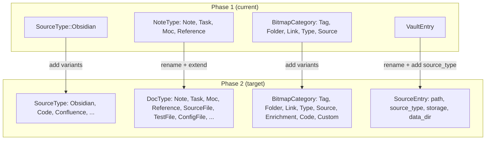

# Phase 2 Alignment — Contradictions & Resolution Plan

> Status: **Pre-work audit**
> Purpose: Identify contradictions between Phase 1 code/docs and Phase 2 plan before implementation begins

---

## Summary

Five contradictions found, two moderate and three minor. None require large rewrites — all are additive changes or small type adjustments. One conceptual gap (multi-source identity) needs a design decision before starting Workstream 3.

---

## 1. `SourceType` enum is closed and Obsidian-only

### The contradiction

**Phase 1 code** (`locus-core/src/types.rs`):
```rust
pub enum SourceType {
    Obsidian,
    // Future: Code, Confluence, etc.
}
```

**Phase 2 plan** (Workstream 3, code intelligence):
> `locus init <path> --type code` — register a code repository

**Config** (`config.toml` in 005):
```toml
[sources.code.backend]
path = "/home/user/repos/backend"
```

The ingestion pipeline hardcodes `SourceType::Obsidian` in `source_key()`:
```rust
fn source_key(source_type: &SourceType) -> BitmapKey {
    let label = match source_type {
        SourceType::Obsidian => "obsidian",
    };
    format!("source:{label}")
}
```

**Problem**: Adding `SourceType::Code` is a breaking match — every `match source_type` in the codebase will fail to compile until updated. That's fine and intentional (Rust's exhaustive matching is a feature), but the bigger issue is that the config model (`VaultEntry`) is vault-centric:

```rust
pub struct VaultEntry {
    pub path: PathBuf,
    pub storage: StorageMode,
    pub data_dir: PathBuf,
}
```

No `source_type` field. The config assumes everything is a "vault" (Obsidian). A code repo isn't a vault.

### Resolution

| Change | Scope | When |
|--------|-------|------|
| Add `Code` variant to `SourceType` | `locus-core/types.rs` | Start of Workstream 3 |
| Rename `VaultEntry` → `SourceEntry`, add `source_type: SourceType` field | `locus-core/config.rs` | Start of Workstream 3 |
| Rename `vaults` → `sources` in `BiemConfig` | `locus-core/config.rs` | Start of Workstream 3 |
| Rename CLI references from "vault" → "source" where generic | `locus-cli` | Start of Workstream 3 |
| Rename config section `[vaults.*]` → `[sources.*]` | Config format | Breaking config change — needs migration note |
| Update `001-system-overview.md` and `003-contracts.md` | Docs | Same PR |

**Risk**: Low. `VaultEntry` is used in config load/save and CLI init. Renaming is mechanical. The config format change is the only user-facing break.

**Decision needed**: Do we rename now (before Phase 2) or at Workstream 3 start? Renaming now is cleaner but creates churn with no immediate benefit.

**Recommendation**: Rename at Workstream 3 start, document the config migration in the changelog.

---

## 2. `BitmapCategory` doesn't cover Phase 2 key namespaces

### The contradiction

**Phase 1 code**:
```rust
pub enum BitmapCategory {
    Tag,
    Folder,
    Link,
    Type,
    Source,
}
```

**Phase 2 plan** introduces new bitmap key prefixes:
- Enrichment: `topic:*`, `concept:*`, `intent:*`, `quality:*`, `complexity:*`, `convention:*`, `team:*`, `domain:*`, `priority:*`
- Code: `lang:*`, `kind:*`, `visibility:*`, `async:*`, `import:*`, `repo:*`

None of these fit the existing 5 categories. The catalog uses `BitmapCategory` to filter keys — if enrichment/code keys don't have a category, `locus bitmaps --category tag` works but there's no way to list only enrichment keys or code keys.

### Resolution

Two options:

**Option A — Extend the enum** (more variants):
```rust
pub enum BitmapCategory {
    Tag, Folder, Link, Type, Source,
    // Phase 2
    Topic, Concept, Intent, Quality, Complexity, Convention,
    Lang, Kind, Visibility, Import, Repo,
    Custom(String),  // catch-all for user-defined tagger prefixes
}
```
Problem: `Custom(String)` breaks `Eq`/`Hash` simplicity and the enum grows unboundedly.

**Option B — Make category a `String`** (free-form, derived from key prefix):
```rust
pub struct BitmapCatalogEntry {
    pub bitmap_key: BitmapKey,
    pub category: String,  // derived from key prefix: "tag", "folder", "concept", etc.
    // ...
}
```
Problem: Loses type safety, any typo creates a new category silently.

**Option C — Group categories** (recommended):
```rust
pub enum BitmapCategory {
    // Structural (from parser)
    Tag,
    Folder,
    Link,
    Type,
    Source,
    // Enrichment (from taggers)
    Enrichment,
    // Code (from code parser)
    Code,
    // Custom (user-defined taggers)
    Custom,
}
```
The category is a coarse grouping for catalog browsing. Fine-grained filtering uses the key prefix directly (e.g., `list_keys(Some("concept:"))`). The `list_keys` prefix filter already exists on `BitmapStore` and works for this.

**Recommendation**: Option C. Add `Enrichment`, `Code`, `Custom` variants. The catalog groups keys coarsely; prefix filtering handles the rest. This is a small, additive change.

---

## 3. `NoteType` vs generic document type

### The contradiction

**Phase 1 code**:
```rust
pub enum NoteType {
    Note, Task, Moc, Reference,
}
```

This is used in `DocRecord.auto_type` and in bitmap keys (`type:task`, `type:moc`).

**Phase 2 plan** (code intelligence):
> `doc_type: String,  // "note", "task", "function", "class", "page"`

A code file isn't a "note" or a "task". The `NoteType` enum doesn't accommodate code document types. The feature set doc shows `doc_type` as a `String` in `MatchPointer`, which already differs from the code's `Option<NoteType>`.

**Phase 2 plan** also shows extended `ChunkKind` variants (`Function`, `Class`, etc.) — these are already in `locus-core`'s `ChunkKind` enum, which is correct. But the *document-level* type is still `NoteType`.

### Resolution

| Option | Description | Trade-off |
|--------|-------------|-----------|
| **A — Rename to `DocType`, extend** | `DocType { Note, Task, Moc, Reference, SourceFile, TestFile, ConfigFile, ... }` | Growing enum, but type-safe |
| **B — Make it a `String`** | `auto_type: Option<String>` | Flexible but untyped |
| **C — Keep `NoteType` for markdown, add `CodeType` for code, union them** | `DocType = NoteType | CodeType` | More enums, cleaner per-source |

**Recommendation**: Option A. Rename `NoteType` → `DocType`, keep existing variants, add code variants when Workstream 3 starts. The rename is mechanical (find-replace). The bitmap key format (`type:task`) stays the same — just the Rust type name changes.

This also aligns with `MatchPointer.auto_type` which is already a `String` in the query response — the serialisation just calls `.to_string()` on the enum.

---

## 4. Config model has no enrichment/semantic sections

### The contradiction

**Phase 1 code** (`config.rs`):
```rust
pub struct BiemConfig {
    pub vaults: BTreeMap<String, VaultEntry>,
}
```

**Phase 2 plan** expects:
```toml
[enrichment]
enabled = true
builtin_taggers = ["topic", "convention", "complexity", "size"]

[enrichment.llm]
enabled = false
backend = "openai"

[semantic]
enabled = false
embedder = "fastembed"
```

The config struct has no fields for enrichment or semantic configuration.

### Resolution

This is purely additive — no contradiction, just missing fields. Add when the relevant workstream starts:

```rust
pub struct BiemConfig {
    pub sources: BTreeMap<String, SourceEntry>,  // renamed from vaults
    pub enrichment: Option<EnrichmentConfig>,     // Workstream 1
    pub semantic: Option<SemanticConfig>,          // Workstream 2
}
```

**No action needed now** — this is expected greenfield work. Flagging it here so the config migration (vault→source rename) and enrichment config are done in one pass.

---

## 5. State directory assumes single source type per registration

### The contradiction

**Phase 1 code** — state directory per vault:
```
~/.locus/vaults/<vault-hash>/
  registry.duckdb
  bitmaps.lmdb/
```

**Phase 2 plan** — multiple source types, potentially overlapping paths:
```toml
[sources.notes]
path = "/Users/me/workspace"
type = "obsidian"

[sources.code]
path = "/Users/me/workspace"
type = "code"
```

Same path, two sources. Currently the vault hash is derived from the path — two registrations of the same path would collide.

### Resolution

The hash should incorporate source type:
```rust
// Current (Phase 1)
fn vault_hash(path: &Path) -> String {
    blake3::hash(path.to_string_lossy().as_bytes()).to_hex()[..16].to_string()
}

// Phase 2
fn source_hash(path: &Path, source_type: &SourceType) -> String {
    let mut hasher = blake3::Hasher::new();
    hasher.update(path.to_string_lossy().as_bytes());
    hasher.update(source_type.as_str().as_bytes());
    hasher.finalize().to_hex()[..16].to_string()
}
```

Alternatively, use the source name (the TOML key) as the directory name:
```
~/.locus/sources/notes/
  registry.duckdb
  bitmaps.lmdb/
~/.locus/sources/code/
  registry.duckdb
  bitmaps.lmdb/
```

**Recommendation**: Use the source name as directory name (not a hash). It's human-readable, debuggable, and avoids the collision problem entirely. The hash approach is opaque. This also means the `data_dir` field in `VaultEntry`/`SourceEntry` is computed from `~/.locus/sources/<name>/`.

**When**: Part of the vault→source rename in Workstream 3.

---

## 6. `list_all_docs` in Registry — missing from contracts doc

### The contradiction

**Code** (`registry.rs`) has:
```rust
fn list_all_docs(&self) -> Result<Vec<DocRecord>, RegistryError>;
```

**Contracts doc** (`003-contracts.md`) doesn't list this method in the `Registry` trait.

### Resolution

Add it to contracts. Minor doc sync issue.

---

## Non-contradictions (confirmed aligned)

These were checked and are fine:

| Concern | Status |
|---------|--------|
| `ChunkKind` already has code variants (`Function`, `Class`, etc.) | ✅ Aligned |
| `ChunkMetadata` already has `signature`, `language`, `visibility` | ✅ Aligned |
| `u32` for DocId/ChunkId — Phase 2 doesn't need u64 | ✅ Aligned (see 001 §9) |
| Bitmap store indexes DocId only, chunks via registry | ✅ Aligned |
| Parser trait is pluggable (`Vec<Box<dyn Parser>>`) | ✅ Ready for CodeParser |
| `BitmapStore` trait has `list_keys(prefix)` — works for new key namespaces | ✅ Aligned |
| Tombstone + compaction model works for multi-source | ✅ Aligned |
| Jaccard methods on BitmapStore | ✅ Aligned |
| Query engine's `Filter` enum (AND/OR/NOT) — works for enrichment/code keys | ✅ Aligned |

---

## Action plan

### Pre-Phase-2 (do now, one commit)

1. Sync `003-contracts.md` — add `list_all_docs` to Registry trait

### Workstream 1 start (enrichment)

2. Add `Enrichment` and `Custom` variants to `BitmapCategory`
3. Add `EnrichmentConfig` to `BiemConfig` (additive)

### Workstream 3 start (code intelligence)

4. Add `Code` variant to `SourceType`
5. Rename `NoteType` → `DocType`, add code variants
6. Rename `VaultEntry` → `SourceEntry`, add `source_type` field
7. Rename `vaults` → `sources` in config struct + TOML format
8. Update state directory naming (source name, not hash)
9. Add `Code` variant to `BitmapCategory`

### Cross-cutting

10. Update `001-system-overview.md` and `003-contracts.md` after each change
11. Update diagrams (Mermaid ER, class diagrams) to match new types

---

## Diagram: Current vs Phase 2 type hierarchy


