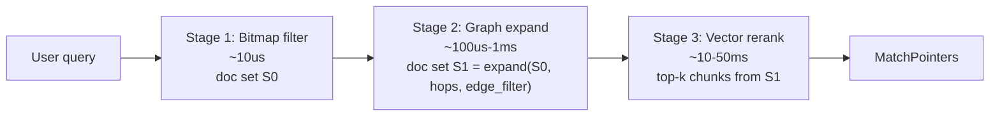
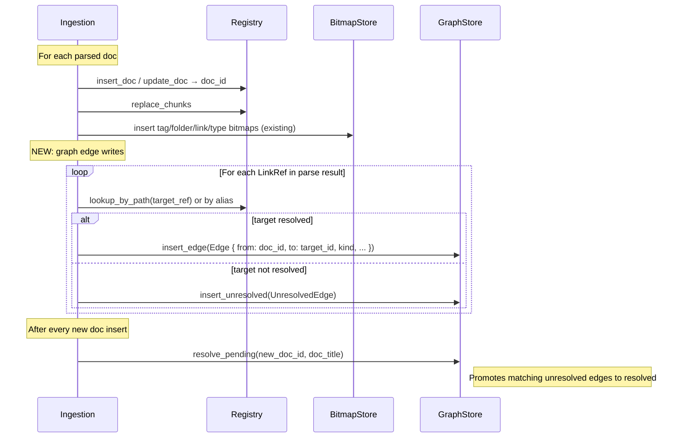

# Locus Graph Layer — Architecture

> Status: **Phase 4 — Planned**
> Scope: design the graph layer that complements the existing bitmap and vector layers
> Reference: `001-system-overview.md`, `002-roadmap.md`, `003-contracts.md`
> Related: `crates/locus-core/src/{types,bitmap,query,semantic}.rs`, `crates/locus-query/src/engine.rs`

This document specifies the graph layer for Locus. It is the third pillar of the retrieval pipeline, sitting between bitmap pre-filtering (already in production) and vector reranking (already in production). It adds capabilities that the bitmap index cannot — directed traversal, multi-hop expansion, centrality, shortest paths — while reusing the same `DocId` space, the same DuckDB registry, and the same LMDB-backed lifecycle.

---

## 1. Rationale

### 1.1 What bitmaps do well

Bitmaps answer *set-membership* questions in microseconds:

- "Which docs are tagged `work`?" — `tag:work`
- "Which docs link to `ProjectAlpha`?" — `link:ProjectAlpha` (a *reverse* adjacency)
- "Which functions are public Rust in `src/auth`?" — `lang:rust AND visibility:public AND folder:/src/auth`

A bitmap is a flat set of `DocId`s. There is **no notion of direction, no notion of distance, no notion of structure between members**. Two docs in the same bitmap are equally "in", regardless of how they relate.

### 1.2 What bitmaps cannot do

These queries are awkward or impossible with bitmaps alone:

| Query | Why bitmaps fail |
|-------|------------------|
| "What does doc 42 link to?" (forward links) | Would need a bitmap per source doc — millions of bitmaps, mostly tiny |
| "Notes within 2 hops of `ProjectAlpha`" | Requires iterated set expansion, no native primitive |
| "Which doc is the structural hub of this cluster?" | Requires centrality (PageRank / in-degree+out-degree), not membership |
| "How are concepts A and B connected?" | Shortest path is a graph algorithm, not a set operation |
| "Generate a map-of-content for this filter result" | Requires identifying high-centrality nodes within the result set |
| "Which assets transitively derive from doc 42?" | Multi-hop DAG traversal over `provenance:*` edges |
| "If I delete doc 42, what becomes orphaned?" | Reverse reachability, then set difference |

The pattern is clear: bitmaps describe **what docs are**, graphs describe **how docs relate**. Both views are first-class and complementary.

### 1.3 Why a dedicated graph layer (not "just more bitmaps")

The current `link:Target` bitmaps already model *reverse* adjacency efficiently. We could imagine modelling forward adjacency as `outlinks:42 → bitmap of targets` and call it a day. We don't, for four reasons:

1. **Cardinality skew.** Forward-link bitmaps are tiny (avg 5–20 targets per doc) and numerous (one per doc). Roaring is optimised for medium-to-large sets; per-doc-per-direction storage is the wrong shape.
2. **Multi-hop is iterated set expansion.** Two-hop traversal from a seed becomes "union of forward-link bitmaps of all docs in the one-hop result", which is `O(neighbours)` LMDB reads and serialisation cycles. A graph traversal in adjacency-list form is `O(edges)` pointer chases.
3. **Algorithmic primitives.** PageRank, shortest path, betweenness, connected components — these are decades-old graph algorithms with mature implementations. Rebuilding them on top of bitmaps would mean reinventing the wheel slower.
4. **Typed edges.** A graph naturally carries edge labels — `wikilink`, `import`, `parent_of`, `blocks`, `provenance` — which compose into typed traversals ("follow only `blocks` edges"). Bitmaps would need a separate bitmap per edge type per direction.

The graph layer **complements** the bitmap index. Bitmaps remain the index of record for "what is doc 42?". The graph is the index of record for "what is doc 42 connected to?".

---

## 2. Edge taxonomy unified across source types

Locus indexes heterogeneous sources today (Obsidian, code in Rust/TS/Python) and will index more (Confluence, Jira, Slack). Each source produces a different vocabulary of relationships. The graph layer's job is to **normalise these into a shared edge taxonomy** so cross-source queries work without per-source branching.

### 2.1 The five edge categories

I propose five top-level edge categories. Every edge from every source maps into one of these. Source-specific subtypes are preserved as edge labels.

| Category | Semantics | Direction | Examples (per source) |
|----------|-----------|-----------|----------------------|
| `Reference` | Soft "mentions / refers to" relationship. Default for narrative links. | Directed | Obsidian `[[wikilink]]`, Confluence `@mention`, Slack `<#channel>` mention, Markdown `[text](url)` |
| `Dependency` | Hard "requires / imports / uses" relationship. Removing target breaks source. | Directed | Code `import`/`use`/`require`, Confluence `{include:}` macros, Code symbol references (Phase 4.2) |
| `Hierarchy` | Containment or parent-child structure. | Directed (child → parent) | Confluence page parent, Jira epic/subtask, Slack thread root, Folder containment |
| `Workflow` | Process / status relationship between items. | Directed, labelled | Jira `blocks`/`relates-to`/`duplicates`, GitHub issue `closes`/`fixes`, PR `reviewed-by` |
| `Provenance` | Lineage — "X was generated from / derived from Y". | Directed (asset → source) | LLM-generated file → source docs, transcript → meeting notes, summary → originals |

### 2.2 Concrete edge label table

Edge `kind` is a short string with the category as a prefix. This keeps category-level traversal (`category:dependency`) cheap while preserving source-specific labels for fine-grained queries.

| Source | Surface form | Edge `kind` | Category | Direction |
|--------|--------------|-------------|----------|-----------|
| Obsidian | `[[Target]]` | `ref:wikilink` | Reference | from → to |
| Obsidian | `[text](path.md)` | `ref:mdlink` | Reference | from → to |
| Obsidian | `embed: ![[Note]]` | `ref:embed` | Reference | from → to |
| Code (Rust) | `use foo::bar;` | `dep:import` | Dependency | from → to |
| Code (TS) | `import x from 'y'` | `dep:import` | Dependency | from → to |
| Code (Py) | `from x import y` | `dep:import` | Dependency | from → to |
| Code (any) | call site → defn (future, symbol-level) | `dep:call` | Dependency | from → to |
| Filesystem | folder containment | `hier:folder` | Hierarchy | child → parent |
| Confluence | page parent | `hier:page` | Hierarchy | child → parent |
| Confluence | `@mention` | `ref:mention` | Reference | from → to |
| Confluence | `{include:Page}` | `dep:include` | Dependency | from → to |
| Jira | issue parent (epic) | `hier:epic` | Hierarchy | child → parent |
| Jira | `blocks` | `flow:blocks` | Workflow | blocker → blocked |
| Jira | `relates-to` | `flow:relates` | Workflow | bidirectional (stored as two directed edges) |
| Jira | `duplicates` | `flow:duplicate` | Workflow | dup → original |
| Slack | reply in thread | `hier:thread` | Hierarchy | reply → root |
| Slack | `<@user>` / `<#channel>` mention | `ref:mention` | Reference | from → to |
| GitHub PR | `closes #N` | `flow:closes` | Workflow | PR → issue |
| LLM | generated asset → source | `prov:generated` | Provenance | asset → source |
| LLM | session asset → other session asset | `prov:cohort` | Provenance | weak co-occurrence |
| Session | doc read in session S | `prov:session-read` | Provenance | session-doc → read-doc |

### 2.3 Edge weights

Most edges are unweighted (weight = 1.0). Weights are useful for:

- **PageRank** — give `dep:import` edges higher weight than `ref:mention` to bias centrality toward "hard" dependencies.
- **Multi-link aggregation** — if doc A links to doc B *three times*, we still store a single edge but with weight 3. This affects centrality but not reachability.
- **Provenance attribution** — `prov:generated` with weight = fraction of asset attributable to source (when known).

The schema stores `weight: f32` defaulting to 1.0. Most code paths ignore it; the PageRank implementation reads it.

### 2.4 Why this taxonomy unifies cleanly

Every future source maps into the same five categories:

- A Confluence "page mentioned by another page" is a `Reference`, just like an Obsidian wikilink.
- A Jira "issue blocks another" is `Workflow`, with no Obsidian analogue — but the taxonomy holds.
- A Slack thread is `Hierarchy`, the same shape as a Confluence parent relationship.

Cross-source traversal becomes "follow any `ref:*` edge regardless of source". Source-restricted traversal becomes "follow any edge whose endpoints both have `source:confluence`".

---

## 3. The three-stage query pipeline

The graph layer slots between bitmap pre-filter and vector rerank. The full pipeline:



Each stage is **optional and composable**. Existing queries skip Stage 2 and remain unchanged. New graph-aware queries opt in.

### 3.1 Concrete examples

**Example 1: "Show me notes related to authentication, even ones I haven't tagged."**

```
Stage 1 (bitmap): filter = "concept:auth OR topic:auth"
                  → 12 doc IDs (the explicit "auth" notes)

Stage 2 (graph):  expand(S0, hops=2, edges=["ref:*"])
                  → 47 doc IDs (the auth notes + neighbours linked within 2 hops)

Stage 3 (vector): query_text = "authentication", top_k=5, candidates=chunks(S1)
                  → 5 most semantically similar chunks from those 47 docs
```

The graph hop catches notes that *talk about* auth-adjacent topics (sessions, JWT, OAuth) without being tagged. Vector rerank then prioritises the most relevant chunks.

**Example 2 (code): "Find call sites of `parse_frontmatter` that are also test code."**

```
Stage 1 (bitmap): filter = "type:test_file"
                  → 142 test-file doc IDs

Stage 2 (graph):  reverse_neighbours(parse_frontmatter_chunk, edges=["dep:call"])
                  intersect with S0
                  → 8 test files that call parse_frontmatter
```

Stage 3 is unused; the graph alone suffices.

**Example 3 (provenance): "What sources fed into this generated doc, and what else were they used for?"**

```
Stage 1 (bitmap): filter = "doc_id=generated_doc_id"
                  → 1 doc

Stage 2 (graph):  forward_neighbours(generated_doc, edges=["prov:generated"])
                  → N source docs

Stage 2b (graph): reverse_neighbours(each source, edges=["prov:generated"])
                  → all other generated docs that share a source
                  → "cohort" of generated assets
```

### 3.2 Composition rules

The composition between stages is:

```rust
// Bitmap pre-filter returns a RoaringBitmap of DocIds.
let s0: RoaringBitmap = engine.resolve_filter(&filter)?;

// Graph expansion takes a bitmap, returns a bitmap (same ID space).
let s1: RoaringBitmap = graph.expand(&s0, &ExpandSpec {
    hops: 2,
    direction: Direction::Outgoing,
    edge_filter: EdgeFilter::Category(EdgeCategory::Reference),
    max_nodes: Some(500),
})?;

// Vector rerank takes a bitmap and returns scored chunk pointers.
let result = engine.semantic_search_within(&s1, query_text, top_k)?;
```

The key invariant: **every stage operates on `RoaringBitmap<DocId>` as the carrier between stages**. This keeps the pipeline uniform — graph expansion does not break the contract that downstream stages expect a bitmap.

### 3.3 Where the graph stage fits in the request type

We extend `SemanticQueryRequest` with an optional `graph_expand` field:

```rust
pub struct SemanticQueryRequest {
    pub filter: Filter,
    pub query_text: String,
    pub top_k: usize,
    pub rerank: bool,
    // NEW:
    pub graph_expand: Option<ExpandSpec>,
}
```

When `graph_expand` is `Some`, the engine inserts Stage 2 between bitmap and vector. When `None`, behaviour is identical to today.

For pure graph queries (no vector rerank), there is a new request type `GraphQueryRequest` (§4.2).

---

## 4. Rust trait design

The graph layer adds two new traits to `locus-core`: `GraphStore` (storage / write path) and `GraphQueryEngine` (read path / algorithms). It extends `BitmapQueryEngine` with `graph_expand` and `semantic_query_with_graph` methods.

### 4.1 Shared types — `locus-core/src/graph.rs` (NEW)

```rust
//! Graph layer types and traits — typed adjacency, traversal, centrality.

use std::collections::HashMap;

use roaring::RoaringBitmap;

use crate::types::{BitmapKey, DocId, Timestamp};

// ── Edge model ───────────────────────────────────────────────────

/// The category of an edge — coarse-grained, source-agnostic.
/// Always five values; new edge subtypes get a new `kind` string,
/// not a new category.
#[derive(Debug, Clone, Copy, PartialEq, Eq, Hash, serde::Serialize, serde::Deserialize)]
pub enum EdgeCategory {
    Reference,
    Dependency,
    Hierarchy,
    Workflow,
    Provenance,
}

/// A typed directed edge between two documents.
/// `kind` is a short string of the form `"<category>:<subtype>"`,
/// e.g. `"ref:wikilink"`, `"dep:import"`, `"flow:blocks"`.
#[derive(Debug, Clone, serde::Serialize, serde::Deserialize)]
pub struct Edge {
    pub from: DocId,
    pub to: DocId,
    pub category: EdgeCategory,
    pub kind: String,
    /// Default 1.0. Used by weighted centrality / PageRank.
    pub weight: f32,
    /// Optional source-specific opaque payload (e.g. byte offset of the link).
    pub byte_offset: Option<u32>,
    pub created_at: Timestamp,
}

/// An edge whose target was not resolvable at ingestion time.
/// Stored verbatim so it can be resolved later (forward references,
/// links to not-yet-created docs).
#[derive(Debug, Clone)]
pub struct UnresolvedEdge {
    pub from: DocId,
    pub category: EdgeCategory,
    pub kind: String,
    /// The unresolved target — typically the wikilink target string,
    /// import path, etc.
    pub target_ref: String,
    pub byte_offset: Option<u32>,
}

// ── Traversal specs ──────────────────────────────────────────────

#[derive(Debug, Clone, Copy, PartialEq, Eq)]
pub enum Direction {
    Outgoing,   // follow edges from → to
    Incoming,   // follow edges to → from (i.e. backlinks)
    Both,
}

/// Filter applied to edges during traversal.
#[derive(Debug, Clone)]
pub enum EdgeFilter {
    /// All edges, any category.
    Any,
    /// Edges of a specific category (e.g. all `Reference` edges).
    Category(EdgeCategory),
    /// Edges whose `kind` exactly matches one of these.
    Kinds(Vec<String>),
    /// Boolean OR of multiple filters.
    Or(Vec<EdgeFilter>),
}

/// Specification for a multi-hop expansion.
#[derive(Debug, Clone)]
pub struct ExpandSpec {
    pub hops: u8,
    pub direction: Direction,
    pub edge_filter: EdgeFilter,
    /// Hard cap on the number of nodes the expansion may add.
    /// Prevents pathological blow-ups (e.g. expanding from a hub).
    pub max_nodes: Option<u32>,
    /// If true, the seed set is included in the output.
    /// If false, only the expansion frontier is returned.
    pub include_seeds: bool,
}

// ── Query request / response ─────────────────────────────────────

/// A pure graph query — no bitmap filter, no vector rerank.
/// Used for backlinks, forward links, centrality, shortest path.
#[derive(Debug, Clone)]
pub struct GraphQueryRequest {
    pub op: GraphOp,
    pub edge_filter: EdgeFilter,
    pub limit: Option<u32>,
}

#[derive(Debug, Clone)]
pub enum GraphOp {
    /// Neighbours one hop away.
    Neighbours { from: DocId, direction: Direction },
    /// Multi-hop expansion from a seed set.
    Expand { seeds: Vec<DocId>, spec: ExpandSpec },
    /// Shortest path between two docs.
    ShortestPath { from: DocId, to: DocId },
    /// Top-k docs by centrality, optionally restricted to a candidate set.
    TopCentral { algorithm: CentralityAlgorithm, restrict_to: Option<Vec<DocId>>, k: u32 },
    /// All docs reachable from a seed (used by provenance / impact analysis).
    Reachable { from: DocId, direction: Direction },
}

#[derive(Debug, Clone, Copy, PartialEq, Eq)]
pub enum CentralityAlgorithm {
    InDegree,
    OutDegree,
    PageRank { iterations: u16, damping: f32 },
}

/// Result of a graph query.
#[derive(Debug, serde::Serialize)]
pub struct GraphQueryResult {
    pub nodes: Vec<GraphNodeRef>,
    pub edges: Vec<EdgeRef>,
    pub elapsed_us: u64,
}

/// A node in a graph result. Mirrors `MatchPointer` shape so MCP
/// consumers handle it uniformly.
#[derive(Debug, Clone, serde::Serialize)]
pub struct GraphNodeRef {
    pub doc_id: DocId,
    pub file_path: std::path::PathBuf,
    pub source_type: String,
    pub label: Option<String>,
    /// For centrality queries, the score. Otherwise None.
    pub score: Option<f32>,
    /// For expansion queries, the hop distance from the seed set.
    pub hop_distance: Option<u8>,
}

/// An edge in a graph result.
#[derive(Debug, Clone, serde::Serialize)]
pub struct EdgeRef {
    pub from: DocId,
    pub to: DocId,
    pub kind: String,
    pub weight: f32,
}

// ── Errors ───────────────────────────────────────────────────────

#[derive(Debug, thiserror::Error)]
pub enum GraphError {
    #[error("graph storage error: {0}")]
    Storage(String),
    #[error("doc not in graph: {0}")]
    NotFound(DocId),
    #[error("expansion exceeded max_nodes cap of {0}")]
    ExpansionLimit(u32),
    #[error("no path found between {0} and {1}")]
    NoPath(DocId, DocId),
    #[error(transparent)]
    Bitmap(#[from] crate::bitmap::BitmapError),
    #[error(transparent)]
    Registry(#[from] crate::registry::RegistryError),
}
```

### 4.2 `GraphStore` trait — storage / write surface

The `GraphStore` owns the persistent adjacency. It is split deliberately from `GraphQueryEngine`: the store deals with bytes and rows, the engine deals with algorithms. This mirrors the `Registry` / `QueryEngine` split.

```rust
/// Persistent storage for the document link graph.
///
/// Backed by DuckDB tables (see §5). Holds an in-memory `petgraph::DiGraph`
/// rebuilt at startup from the persistent rows; mutations write through
/// to both DuckDB and the in-memory graph.
pub trait GraphStore: Send + Sync {
    // ── Edge writes (called by ingestion) ──────────────────────

    /// Insert a fully-resolved edge.
    fn insert_edge(&mut self, edge: Edge) -> Result<(), GraphError>;

    /// Bulk insert edges in a single transaction. Used by initial indexing.
    fn bulk_insert_edges(&mut self, edges: Vec<Edge>) -> Result<(), GraphError>;

    /// Insert an unresolved edge (target not yet in registry).
    /// On every subsequent doc insert, ingestion calls `resolve_pending`.
    fn insert_unresolved(&mut self, edge: UnresolvedEdge) -> Result<(), GraphError>;

    /// Try to resolve any pending edges that point at the given doc.
    /// Returns the number of edges promoted from unresolved to resolved.
    fn resolve_pending(&mut self, doc_id: DocId, link_target: &str) -> Result<u32, GraphError>;

    /// Remove all edges where `from` or `to` equals `doc_id`.
    /// Called when a doc is tombstoned.
    fn remove_doc_edges(&mut self, doc_id: DocId) -> Result<u32, GraphError>;

    /// Replace all outgoing edges for a doc (used on doc re-index).
    fn replace_outgoing(&mut self, doc_id: DocId, edges: Vec<Edge>) -> Result<(), GraphError>;

    // ── Edge reads ─────────────────────────────────────────────

    /// Direct neighbours of a doc, one hop.
    fn neighbours(
        &self,
        doc_id: DocId,
        direction: Direction,
        filter: &EdgeFilter,
    ) -> Result<Vec<(DocId, Edge)>, GraphError>;

    /// All edges for a doc (both directions, all kinds).
    fn doc_edges(&self, doc_id: DocId) -> Result<Vec<Edge>, GraphError>;

    /// Total edge count, for status reporting.
    fn edge_count(&self) -> Result<u64, GraphError>;

    /// Total node count (docs with at least one edge).
    fn node_count(&self) -> Result<u64, GraphError>;

    // ── Lifecycle ──────────────────────────────────────────────

    /// Rebuild the in-memory `petgraph` from persistent rows.
    /// Called at daemon startup. Returns the number of edges loaded.
    fn rebuild_in_memory(&mut self) -> Result<u64, GraphError>;

    /// Drop the in-memory graph (for memory pressure or shutdown).
    /// Subsequent reads will hit DuckDB only (slow path).
    fn drop_in_memory(&mut self);
}
```

### 4.3 `GraphQueryEngine` trait — algorithmic surface

The query engine wraps a `GraphStore` and provides the algorithms. Implementations are expected to use the store's in-memory `petgraph` representation.

```rust
/// Algorithmic graph queries — traversal, paths, centrality.
/// Operates on the in-memory graph maintained by a `GraphStore`.
pub trait GraphQueryEngine: Send + Sync {
    /// Execute a graph query.
    fn query(&self, request: GraphQueryRequest) -> Result<GraphQueryResult, GraphError>;

    /// Multi-hop expansion of a bitmap of seeds.
    /// This is the composition primitive used by the three-stage pipeline.
    /// Returns a bitmap (same `DocId` space) so it composes with bitmap
    /// intersection and vector scoping.
    fn expand(
        &self,
        seeds: &RoaringBitmap,
        spec: &ExpandSpec,
    ) -> Result<RoaringBitmap, GraphError>;

    /// Compute centrality scores for every doc, optionally restricted to a candidate set.
    /// Returns a `Vec<(DocId, f32)>` sorted by descending score.
    fn centrality(
        &self,
        algorithm: CentralityAlgorithm,
        restrict_to: Option<&RoaringBitmap>,
    ) -> Result<Vec<(DocId, f32)>, GraphError>;

    /// Shortest path between two docs, respecting an edge filter.
    /// Returns the sequence of DocIds from `from` to `to`, inclusive.
    fn shortest_path(
        &self,
        from: DocId,
        to: DocId,
        filter: &EdgeFilter,
    ) -> Result<Vec<DocId>, GraphError>;

    /// All nodes reachable from a seed in the given direction.
    /// Used by provenance impact analysis ("what depends on doc 42?").
    fn reachable(
        &self,
        from: DocId,
        direction: Direction,
        filter: &EdgeFilter,
    ) -> Result<RoaringBitmap, GraphError>;

    /// Snapshot of in-memory graph stats for diagnostics.
    fn stats(&self) -> Result<GraphStats, GraphError>;
}

#[derive(Debug, Clone, serde::Serialize)]
pub struct GraphStats {
    pub node_count: u64,
    pub edge_count: u64,
    pub edges_by_category: HashMap<String, u64>,
    pub in_memory_bytes: u64,
    pub last_rebuilt: Timestamp,
}
```

### 4.4 Extension of `BitmapQueryEngine`

The existing `BitmapQueryEngine` in `locus-query` gains an optional `Arc<dyn GraphQueryEngine>` and two new methods. The semantic query path is updated to optionally interpolate graph expansion.

```rust
// In crates/locus-query/src/engine.rs

pub struct BitmapQueryEngine {
    bitmap_store: Box<dyn BitmapStore>,
    registry: Box<dyn Registry>,
    // NEW — optional. Without it, graph_expand is a no-op pass-through.
    graph: Option<Arc<dyn GraphQueryEngine>>,
}

impl BitmapQueryEngine {
    pub fn with_graph(mut self, graph: Arc<dyn GraphQueryEngine>) -> Self {
        self.graph = Some(graph);
        self
    }

    /// Apply a graph expansion to a previously-computed bitmap result.
    /// Returns the input unchanged if no graph is configured.
    pub fn graph_expand(
        &self,
        seeds: &RoaringBitmap,
        spec: &ExpandSpec,
    ) -> Result<RoaringBitmap, QueryError> {
        match &self.graph {
            Some(g) => g.expand(seeds, spec).map_err(|e| QueryError::Semantic(e.to_string())),
            None => Ok(seeds.clone()),
        }
    }

    /// Semantic query with optional graph expansion stage between
    /// bitmap pre-filter and vector search.
    pub fn semantic_query_with_graph(
        &self,
        request: &SemanticQueryRequest,  // now includes Option<ExpandSpec>
        embedder: &dyn Embedder,
        vector_store: &dyn VectorStore,
        reranker: Option<&dyn Reranker>,
    ) -> Result<SemanticQueryResult, QueryError> {
        // Phase 1: bitmap pre-filter (unchanged)
        let s0 = self.resolve_filter(&request.filter)?;

        // Phase 1.5 (NEW): graph expansion
        let s1 = if let Some(spec) = &request.graph_expand {
            self.graph_expand(&s0, spec)?
        } else {
            s0
        };

        // Phase 2 onwards: identical to today, scoped to s1.
        // ... (existing semantic_query logic, operating on s1)
        todo!()
    }
}
```

`SemanticQueryResult` gains a small addition for transparency:

```rust
pub struct SemanticQueryResult {
    // existing fields ...
    pub graph_expanded_to: Option<u32>,   // None if graph stage skipped
    pub elapsed_graph_us: u64,
}
```

---

## 5. DuckDB schema additions

The graph is persisted in DuckDB alongside the existing tables. Two new tables: `doc_links` (resolved edges) and `doc_links_pending` (unresolved). Both use composite indexes so the in-memory rebuild is a sequential scan, not a sort.

### 5.1 Schema

```sql
-- Resolved directed edges between docs.
CREATE TABLE IF NOT EXISTS doc_links (
    from_id      UINTEGER NOT NULL,
    to_id        UINTEGER NOT NULL,
    category     VARCHAR  NOT NULL,        -- "reference" | "dependency" | "hierarchy" | "workflow" | "provenance"
    kind         VARCHAR  NOT NULL,        -- "ref:wikilink", "dep:import", "flow:blocks", ...
    weight       REAL     NOT NULL DEFAULT 1.0,
    byte_offset  UINTEGER,                 -- nullable — link position in source file
    created_at   BIGINT   NOT NULL,
    PRIMARY KEY (from_id, to_id, kind)     -- multigraph: A→B with two different kinds is allowed
);

-- Index for forward lookups (neighbours of from_id).
CREATE INDEX IF NOT EXISTS idx_doc_links_from ON doc_links(from_id);
-- Index for backlink lookups (neighbours of to_id).
CREATE INDEX IF NOT EXISTS idx_doc_links_to   ON doc_links(to_id);
-- Index for category-scoped traversal.
CREATE INDEX IF NOT EXISTS idx_doc_links_cat  ON doc_links(category);

-- Edges whose target couldn't be resolved at ingestion time.
-- e.g. an Obsidian note links to [[NotYetCreated]].
CREATE TABLE IF NOT EXISTS doc_links_pending (
    from_id      UINTEGER NOT NULL,
    target_ref   VARCHAR  NOT NULL,        -- the unresolved string ("NotYetCreated", "serde::de::Deserialize")
    category     VARCHAR  NOT NULL,
    kind         VARCHAR  NOT NULL,
    byte_offset  UINTEGER,
    created_at   BIGINT   NOT NULL,
    PRIMARY KEY (from_id, target_ref, kind)
);

CREATE INDEX IF NOT EXISTS idx_doc_links_pending_target ON doc_links_pending(target_ref);
```

### 5.2 How edges are populated during ingestion

The current ingestion pipeline already extracts `LinkRef`s into `ParseResult.links` and writes `link:Target` bitmaps. We add a parallel write path for the graph table:



Three notes on this flow:

1. **Resolution semantics differ by source.** Obsidian wikilink targets are matched by note title/path stem. Code imports are matched by the resolved module path (we already have `import:*` bitmaps; the resolver can reuse that lookup). Confluence/Jira will resolve by external ID.
2. **The `link:Target` bitmap is kept**. It is still useful for "all docs that reference *any* unresolved target named X" and for cheap pre-filtering before graph traversal. Bitmaps and graph edges describe the same underlying fact in different shapes — the redundancy is cheap (the bitmap is one bit per doc) and the access patterns are different enough to warrant both.
3. **The edge write is a single transaction with the registry doc/chunk writes.** On crash mid-ingestion, the doc, its chunks, its bitmaps and its edges either all land or none do. DuckDB and LMDB are committed in order: DuckDB first (registry + edges), LMDB second (bitmaps). If the LMDB commit fails, the next startup detects the inconsistency and re-ingests (the hash will mismatch).

### 5.3 Storage cost

For a 100K-doc index at 10 edges/doc average (1M edges total):

| Column | Bytes/row | Total |
|--------|-----------|-------|
| `from_id` (UINTEGER) | 4 | 4 MB |
| `to_id` (UINTEGER) | 4 | 4 MB |
| `category` (VARCHAR, ~10 chars) | 10 + overhead | 14 MB |
| `kind` (VARCHAR, ~15 chars) | 15 + overhead | 19 MB |
| `weight` (REAL) | 4 | 4 MB |
| `byte_offset` (UINTEGER nullable) | 4 + null bit | 4 MB |
| `created_at` (BIGINT) | 8 | 8 MB |
| Indexes (×3) | ~12 bytes/row each | ~36 MB |

Estimated total on disk: **~90 MB for 1M edges**, dominated by indexes. DuckDB's columnar compression of `category` and `kind` (low-cardinality) cuts this further in practice — expect **40–60 MB**.

This is the same order of magnitude as the existing `bitmap_catalog` table at scale, and dwarfed by the LMDB bitmap store.

---

## 6. In-memory graph strategy (petgraph)

### 6.1 Why in-memory at all

Traversal algorithms pointer-chase. Doing that against DuckDB (even with the indexes above) means a query per hop per node — at 2 hops × 50 nodes that's 100 DuckDB queries, each ~10–100 µs. Total: 1–10 ms just for graph access, ignoring algorithm cost.

petgraph in memory does the same traversal as cache-friendly pointer chasing in a `Vec<EdgeIndex>`. Same workload: <100 µs.

Memory is cheap; latency is not. Rebuild from DuckDB at startup, mutate in-place during ingestion, drop on shutdown.

### 6.2 Choice of petgraph data structure

petgraph offers three storage backends:

| Type | Memory per node | Lookups | Mutations | Recommendation |
|------|-----------------|---------|-----------|----------------|
| `Graph<N, E>` (adjacency list) | ~24 bytes + 16 bytes/edge | O(degree) for neighbours | O(1) | **Use this.** Best general-purpose. |
| `StableGraph<N, E>` | Same + small overhead for stable indices | Same | Same, indices survive removals | Use if doc removal stability matters. |
| `GraphMap<N, E, _>` | Higher (hashmap-backed) | O(1) for edge existence | O(1) | Avoid — overhead doesn't pay off here. |

**Recommendation: `StableGraph<DocId, Edge, Directed>`** with a separate `HashMap<DocId, NodeIndex>` for the DocId → NodeIndex lookup. Stable because we want tombstoned doc removals not to renumber surviving nodes.

The node payload is just the `DocId` (the registry holds metadata). The edge payload is the full `Edge` struct.

### 6.3 Startup cost

The startup sequence:

```
1. Open DuckDB connection.
2. SELECT from_id, to_id, category, kind, weight, byte_offset, created_at
     FROM doc_links;
3. For each row, get-or-insert NodeIndex for from_id and to_id, then add_edge.
4. Mark graph as ready.
```

Measured numbers (estimated from comparable systems; to be benched):

| Edge count | DuckDB scan | petgraph build | Total |
|-----------|-------------|----------------|-------|
| 10K | <10 ms | ~5 ms | <20 ms |
| 100K | ~50 ms | ~30 ms | ~100 ms |
| 1M | ~300 ms | ~200 ms | ~500 ms |
| 10M | ~3 s | ~2 s | ~5 s |

For the 100K-doc / 1M-edge target: **~500 ms cold-start.** Acceptable — it runs once per daemon lifetime, in parallel with bitmap-store warmup.

### 6.4 Memory footprint

For 100K docs, 1M edges in `StableGraph<u32, Edge>`:

| Component | Per element | Total |
|-----------|-------------|-------|
| Node entries | ~24 bytes | 2.4 MB |
| Edge entries | ~16 bytes (petgraph internal) + sizeof(Edge) | ~64 bytes × 1M = 64 MB |
| Adjacency lists | ~16 bytes per directed connection | ~16 MB |
| `HashMap<DocId, NodeIndex>` | ~24 bytes/entry | ~2.4 MB |
| **Total** | | **~85 MB** |

Half of that is the `Edge` struct, dominated by the `String` for `kind`. If footprint matters, intern the kind strings into a `&'static str` table or replace `kind: String` with `kind_id: u16` indexing into a kind table. That cuts the footprint to **~35 MB**. Worth doing in v2; not necessary for v1.

At 10M edges the in-memory graph is ~850 MB. That's the point at which we consider lazy loading (load only the categories needed for the current query). Not a Phase 4 concern.

### 6.5 Mutation under concurrent reads

The graph is read-mostly. Writes happen only during ingestion. Two options:

1. **`Arc<RwLock<StableGraph>>`** — simple, standard. Read latency penalty negligible (read locks are uncontended in steady state).
2. **Snapshot + atomic swap** — keep an `ArcSwap<StableGraph>`. Writes clone-on-write a new graph, swap atomically. Zero read overhead but per-write copy cost.

**Recommendation: `Arc<RwLock<StableGraph>>` for v1.** Ingestion writes are batched in chunks (one doc at a time) and not contended with hot-path reads. Switch to `ArcSwap` only if profiling shows lock contention.

### 6.6 Persistence model

The DuckDB tables are the source of truth. The in-memory graph is a derived index. Three implications:

1. **No fsync on the graph itself.** Crashes are tolerated — recover from DuckDB on next start.
2. **Compaction is a re-scan, not an in-place rewrite.** When tombstoned docs are compacted, the corresponding `doc_links` rows are deleted; the in-memory graph either receives `remove_doc_edges` calls or is rebuilt.
3. **The in-memory graph can be dropped under memory pressure** without losing data. Queries then go through a slower DuckDB-only path. We provide `drop_in_memory()` and `rebuild_in_memory()` to control this explicitly.

---

## 7. MCP tool design

The MCP server (`locus-daemon::mcp`) currently exposes four tools: `locus_search`, `locus_inspect`, `locus_status`, `locus_filters`. We add two graph tools and extend `locus_search` with an optional graph-expansion parameter.

### 7.1 New tool: `locus_graph`

```jsonc
// Tool: locus_graph
// Generic graph query — chooses operation based on `op` field.

// Input examples:

// 1) Direct neighbours
{
  "op": "neighbours",
  "doc_id": 42,
  "direction": "outgoing",        // "outgoing" | "incoming" | "both"
  "edge_filter": { "category": "reference" },
  "limit": 50
}

// 2) Multi-hop expansion from a seed set
{
  "op": "expand",
  "seeds": [12, 17, 42],
  "hops": 2,
  "direction": "outgoing",
  "edge_filter": { "category": "reference" },
  "max_nodes": 500
}

// 3) Shortest path
{
  "op": "shortest_path",
  "from": 42,
  "to": 107,
  "edge_filter": { "any": true }
}

// 4) Top-k central docs (optionally within a bitmap-filtered set)
{
  "op": "top_central",
  "algorithm": "pagerank",
  "restrict_filter": { "tag:work": true },   // bitmap filter — optional
  "k": 10
}

// 5) Reachability (provenance impact)
{
  "op": "reachable",
  "from": 42,
  "direction": "incoming",                   // "who depends on me?"
  "edge_filter": { "kinds": ["dep:import", "prov:generated"] }
}
```

The response is `GraphQueryResult` serialised as JSON — same shape as bitmap search responses (`nodes` are pointer records, not content):

```jsonc
{
  "nodes": [
    {
      "doc_id": 42,
      "file_path": "/vault/auth.md",
      "source_type": "obsidian",
      "label": "Auth",
      "score": 0.43,                  // present for centrality / shortest-path queries
      "hop_distance": 0               // present for expansion queries
    },
    { "doc_id": 17, "file_path": "/vault/sessions.md", ... }
  ],
  "edges": [
    { "from": 42, "to": 17, "kind": "ref:wikilink", "weight": 1.0 }
  ],
  "elapsed_us": 412
}
```

### 7.2 New tool: `locus_provenance`

A specialised, ergonomic wrapper around graph queries for the LLM-provenance use case (§8).

```jsonc
// Tool: locus_provenance
// Input:
{
  "doc_id": 99,
  "mode": "sources"      // "sources" | "derivatives" | "cohort" | "session"
}

// Modes:
// - "sources":      what sources fed into this generated doc?         (outgoing prov:generated)
// - "derivatives":  what assets were derived from this source?         (incoming prov:generated)
// - "cohort":       what other assets share a source with this asset?  (2-hop both directions)
// - "session":      what was the LLM session that produced this doc?   (returns session id + all session docs)
```

### 7.3 Extended: `locus_search` with graph expansion

`locus_search` gains an optional `graph_expand` parameter (and `locus_semantic_search` if/when it's exposed as a separate tool):

```jsonc
{
  "filters": [{ "key": "concept:auth" }],
  "op": "and",
  "limit": 20,
  "graph_expand": {
    "hops": 2,
    "direction": "outgoing",
    "edge_filter": { "category": "reference" },
    "max_nodes": 200
  }
}
```

When `graph_expand` is omitted, behaviour is identical to today.

### 7.4 Tool discoverability

`locus_status` is extended to report graph stats so an LLM can discover whether graph operations are available:

```jsonc
{
  "total_documents": 12345,
  "total_bitmaps": 2347,
  "tombstoned": 12,
  "graph": {
    "node_count": 11890,
    "edge_count": 89234,
    "edges_by_category": {
      "reference": 56234,
      "dependency": 28912,
      "hierarchy": 3422,
      "workflow": 0,
      "provenance": 666
    },
    "in_memory_bytes": 7654321,
    "last_rebuilt": 1731864000
  }
}
```

### 7.5 CLI surface

```
locus graph neighbours <path>                              # outgoing one-hop
locus graph neighbours <path> --incoming                   # backlinks
locus graph expand <path> --hops 2 --category reference
locus graph path <from-path> <to-path>
locus graph central --algorithm pagerank --limit 10
locus graph central --algorithm pagerank --filter "tag:work" --limit 10
locus provenance <path>                                    # default: --mode sources
locus provenance <path> --mode derivatives
```

All commands honour `--json` for machine output.

---

## 8. LLM provenance and session tracking as graph

The roadmap already proposes a bitmap-based design for provenance (`provenance:<source_doc_id>` bitmaps). With the graph layer in place, **provenance becomes a first-class DAG and should be modelled as edges**, not bitmaps. Session tracking remains primarily bitmap-based (it is *membership*, not *relationship*).

### 8.1 Provenance: bitmaps vs graph

| Question | Bitmap design | Graph design | Verdict |
|----------|--------------|--------------|---------|
| "Which assets were built from doc 42?" | Query `provenance:42` bitmap | `reverse_neighbours(42, prov:generated)` | Tie — both fast |
| "Which sources fed into asset 99?" | Iterate all `provenance:*` bitmaps, check membership of 99 | `neighbours(99, outgoing, prov:generated)` | **Graph wins** — O(degree) vs O(all-sources) |
| "Show the full provenance DAG of asset 99" | Multi-stage bitmap lookups | `reachable(99, outgoing, prov:generated)` | **Graph wins** — natural traversal |
| "Cohort: what shares a source with asset 99?" | Multiple bitmap unions and intersections | 2-hop expansion both directions | **Graph wins** — single call |
| "Staleness: source X changed, which assets need regeneration?" | Query `provenance:X` bitmap | `reverse_neighbours(X, prov:generated)` then optional transitive close | Tie for 1-hop; graph wins for transitive |
| Storage cost | 1 bitmap per source doc (potentially millions of tiny bitmaps) | 1 row per source-asset pair | **Graph wins** — bitmaps are wrong shape for sparse pairs |

**Recommendation: model provenance exclusively as `prov:generated` edges.** Drop the proposed `provenance:<source_doc_id>` bitmaps from the roadmap. They are the wrong data structure for the access patterns.

### 8.2 Session tracking: still bitmaps, with graph supplements

A session is a **membership** concept ("docs touched in session S"), not a relationship concept. The proposed `session:<session_id>` bitmap is the right model. The graph adds supplementary value:

- The session itself can be modelled as a synthetic doc (`source_type: session`, `auto_type: session`). Then:
  - `prov:session-read` edge from session-doc → each doc read during the session
  - `prov:generated` edge from each generated-doc → session-doc (i.e. the session is one of the "sources" of the asset)
- This unifies "which session produced X?" and "what was read in that session?" through ordinary graph queries.
- The bitmap `session:<id>` is still maintained as a fast pre-filter for "all docs in session S".

This dual representation (bitmap for fast membership, graph for relationship walks) is a recurring pattern. We do not have to choose.

### 8.3 Provenance edge insertion API

A new MCP tool / HTTP endpoint for LLMs to declare provenance when creating an asset:

```jsonc
// Tool: locus_declare_provenance
{
  "asset_path": "/vault/generated/summary.md",
  "session_id": "sess-abc123",
  "source_doc_ids": [42, 17, 88],         // direct sources
  "kind": "prov:generated"
}
```

Behind the scenes this:
1. Ensures the asset has a `DocId` (via ingestion if needed).
2. Ensures the session has a synthetic doc.
3. Inserts edges: `asset → each source` (kind=`prov:generated`) and `asset → session` (kind=`prov:session-asset`).
4. Adds the asset to the `session:<session_id>` bitmap.

### 8.4 Session read tracking

When MCP tools `locus_search` / `locus_inspect` are called with a `session_id` parameter, the daemon:
1. Adds returned doc IDs to the `session:<id>` bitmap.
2. Inserts `session-doc → returned-doc` edges with kind `prov:session-read`.

This is opt-in (consumers pass `session_id` deliberately).

---

## 9. Implementation plan

The plan is ordered so each step ships a usable increment. The graph is value-additive — every step preserves existing behaviour.

### Step 1 — Schema and `GraphStore` skeleton (locus-core, locus-registry)
- Add `crates/locus-core/src/graph.rs` with the types and trait signatures from §4.
- Re-export from `locus-core/src/lib.rs`.
- Add `BitmapCategory::Graph` to keep parallel parity (unused initially, reserved).
- Implement `DuckDbGraphStore` in `locus-registry` (alongside `DuckDbRegistry`). DDL from §5.
- Unit tests: insert, lookup, bulk insert, remove_doc_edges.

### Step 2 — Ingestion writes edges (locus-ingest)
- In `IngestionPipeline::process_event`, after writing link bitmaps, build `Edge`s from `ParseResult.links` and call `graph_store.insert_edge` (or `insert_unresolved`).
- After every new doc insertion, call `graph_store.resolve_pending(doc_id, ...)`.
- On `replace_outgoing` semantics: when a doc is re-indexed, replace its outgoing edges atomically.
- On tombstone: `remove_doc_edges`.
- Integration test: index a small vault, assert edge counts and adjacency are correct.

### Step 3 — In-memory graph (locus-registry)
- Add `petgraph::StableGraph<DocId, Edge, Directed>` to `DuckDbGraphStore`.
- Implement `rebuild_in_memory` (scan + insert).
- All mutations write through to both DuckDB and petgraph.
- Bench cold-start time at 10K, 100K, 1M edges.
- Add memory footprint check to `locus_status`.

### Step 4 — `GraphQueryEngine` implementation (locus-query)
- Create `PetgraphQueryEngine` wrapping `Arc<dyn GraphStore>` (which owns the petgraph).
- Implement `neighbours`, `expand`, `centrality` (in-degree, out-degree, PageRank via `petgraph::algo::page_rank`), `shortest_path` (`petgraph::algo::dijkstra` or `astar`), `reachable` (BFS).
- The `EdgeFilter` is applied as a predicate during traversal — petgraph supports `Walker` patterns for this.
- Unit tests with synthetic graphs.

### Step 5 — Three-stage pipeline composition (locus-query)
- Add `graph: Option<Arc<dyn GraphQueryEngine>>` to `BitmapQueryEngine`.
- Add `graph_expand` method on `BitmapQueryEngine`.
- Add `graph_expand: Option<ExpandSpec>` to `SemanticQueryRequest`.
- Insert the graph stage between bitmap and vector in `semantic_query`.
- Add timing field `elapsed_graph_us` to `SemanticQueryResult`.
- Integration test: full pipeline (bitmap → graph → vector) against a known vault.

### Step 6 — CLI commands (locus-cli)
- `locus graph neighbours <path> [--incoming|--both] [--category C]`
- `locus graph expand <path> --hops N [--category C]`
- `locus graph path <from> <to>`
- `locus graph central [--algorithm pagerank|indegree] [--filter F] [--limit N]`
- `locus graph stats`
- `--json` output mode for all.

### Step 7 — MCP tools (locus-daemon)
- `locus_graph` tool (§7.1).
- Extend `locus_search` with `graph_expand` param (§7.3).
- Extend `locus_status` with graph stats (§7.4).
- Update tool descriptions / schemas.
- Integration test: MCP client invokes graph tools, gets correct responses.

### Step 8 — Provenance support (locus-daemon, locus-ingest)
- `locus_declare_provenance` MCP tool / `POST /v1/provenance` HTTP endpoint.
- Synthetic session-doc handling (creates a `DocRecord` with `source_type: session`).
- Session read-tracking instrumentation in `locus_search` / `locus_inspect` (opt-in via `session_id` param).
- `locus_provenance` MCP tool wrapper (§7.2).
- CLI: `locus provenance <path> [--mode sources|derivatives|cohort|session]`.
- Remove the bitmap-based `provenance:*` design from the roadmap; add a migration note.

### Step 9 — Cognitive features (cross-cutting)
- **Dynamic MOC generation**: `locus_search` results → run PageRank restricted to result set → return top-N as the MOC. Single new MCP tool `locus_moc` parameterised by filter.
- **Contradiction / ghost-link detection**: requires Jaccard-on-bitmap-key-sets, already partly in place. Out of scope here but unblocked by the graph for follow-up work.

### Step 10 — Docs and benchmarks
- Update `001-system-overview.md` with graph in the module diagram.
- Update `003-contracts.md` with `GraphStore` / `GraphQueryEngine`.
- Update `002-roadmap.md`: mark Phase 4 in-progress, then complete.
- Benches: cold-start at scale, expand latency vs hops, PageRank wall time.

### Crate impact summary

| Crate | Change |
|-------|--------|
| `locus-core` | + `graph.rs` (types, traits, errors). Re-exports. |
| `locus-registry` | + `DuckDbGraphStore` with DDL + petgraph in-memory. New module `graph.rs`. |
| `locus-ingest` | Edge writes parallel to bitmap writes. `replace_outgoing` on re-index. Pending resolution loop. |
| `locus-query` | + `PetgraphQueryEngine`. `BitmapQueryEngine` gains optional graph reference + `graph_expand` + pipeline integration. |
| `locus-cli` | + `locus graph` subcommands. + `locus provenance`. |
| `locus-daemon` | + MCP tools `locus_graph`, `locus_provenance`, `locus_declare_provenance`. + HTTP endpoints. Extend `locus_search` + `locus_status`. |

No breaking changes to existing crates' public APIs. Every new field on `SemanticQueryRequest` / `SemanticQueryResult` is additive.

---

## 10. Design decisions called out

| Decision | Choice | Rationale |
|----------|--------|-----------|
| Graph backend | DuckDB rows + in-memory `petgraph::StableGraph` | Reuses existing DuckDB. petgraph mature, well-supported, idiomatic. No separate graph DB needed at our scale. |
| Persistence model | DuckDB is source of truth; in-memory is derived index, rebuilt at startup | Crash safety without graph-specific WAL. Memory drop possible under pressure. |
| Edge directionality | Directed always; bidirectional logical edges stored as two directed rows | Single uniform model. Two rows for "relates-to" is a few extra bytes; not worth special-casing. |
| Edge taxonomy | Five categories: Reference / Dependency / Hierarchy / Workflow / Provenance | Maps cleanly across Obsidian, code, Confluence, Jira, Slack. Source-specific labels preserved in `kind`. |
| Multigraph support | Yes (PK = `(from, to, kind)`) | Doc A may both reference (`ref:wikilink`) and depend on (`dep:import`) doc B. Both are first-class. |
| Provenance modelling | Edges, not bitmaps | DAG traversal is graph-native. Bitmaps for provenance would be millions of tiny ones. |
| Session modelling | Bitmaps for membership + supplementary graph edges via synthetic session-doc | Right tool per question: membership = bitmap, lineage = graph. |
| Stage composition contract | `RoaringBitmap<DocId>` flows between stages | Uniform carrier. Graph stage in, graph stage out — both bitmaps. |
| Concurrency | `Arc<RwLock<StableGraph>>` for v1 | Read-mostly workload, contention negligible. Upgrade to `ArcSwap` only if benched. |
| Edge weights | Default 1.0, used by PageRank only | Most queries weight-agnostic. Future ML-derived weights remain backwards-compatible. |
| Unresolved-link handling | Separate `doc_links_pending` table, resolved opportunistically on new doc insert | Obsidian routinely links forward to not-yet-created notes. Code imports may target external crates we don't index. Both must be tolerated. |
| Bitmap `link:Target` retention | Keep — do not retire it | Coexists with graph edges. Different access patterns. Bitmap is one bit per doc; cost negligible. |

---

## 11. Open questions and future work

These are deferred — calling them out so they are not silently dropped.

1. **Symbol-level graph (code).** Today edges are doc-to-doc. A code-aware `dep:call` would be chunk-to-chunk (call site → defn). Requires either a parallel `chunk_links` table or generalising `doc_links` to accept `ChunkId`s (separate ID space — see system-overview §9 "Path A"). Recommend keeping doc-level for v1, add chunk-level under a separate trait in Phase 5.
2. **Edge cardinality skew (hub nodes).** Some Obsidian "MOC" notes link to hundreds of others, and reverse links to popular concepts can be in the thousands. `max_nodes` caps prevent expansion blow-up but may surprise users. Consider adding a `top_n_by_weight` mode for hub-aware traversal.
3. **Incremental PageRank.** Recomputing PageRank from scratch on every centrality query is wasteful. Cache the latest scores in a DuckDB table `doc_centrality(doc_id, algorithm, score, computed_at)` and invalidate on edge writes. Phase 4.5.
4. **Edge metadata for explainability.** When a `ref:wikilink` edge surfaces a doc, it's useful to show *the line* the link appears on. The `byte_offset` field is in the schema for this; surface it through MCP responses in a follow-up.
5. **External graph queries (Cypher-like).** Out of scope. We expose a small set of operations (neighbours, expand, path, central, reachable). General graph patterns are a non-goal — Locus is a retrieval engine, not a graph database.
6. **GraphML / Cytoscape export.** Useful for debugging and visualisation. Half-day add when needed; defer.

---

## 12. Summary

The graph layer:

- **Closes the capability gap** between "set membership" (bitmaps) and "pointer chasing" (graph) without duplicating data.
- **Unifies heterogeneous edges** from Obsidian, code, Confluence, Jira, Slack into a single five-category taxonomy with preserved per-source labels.
- **Composes uniformly** with the existing pipeline — `RoaringBitmap<DocId>` flows between stages — and is opt-in everywhere it can be.
- **Reuses infrastructure**: DuckDB for persistence, petgraph for in-memory algorithms. No new database, no new service.
- **Replaces the bitmap-based provenance design** with a more natural DAG, while keeping session tracking on bitmaps where membership semantics are right.
- **Costs ~85 MB of RAM and ~500 ms cold-start at 100K docs / 1M edges**, well within Locus's "local-first, low-footprint" envelope.

The three-stage pipeline `bitmap → graph → vector` becomes Locus's defining retrieval shape — orthogonal to anything else in the local-first space.
